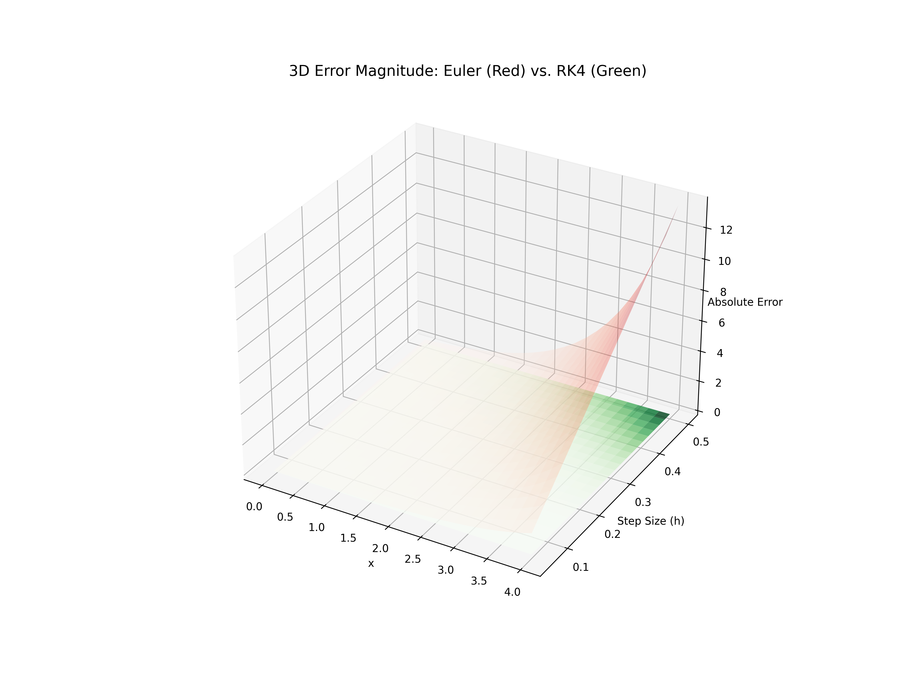
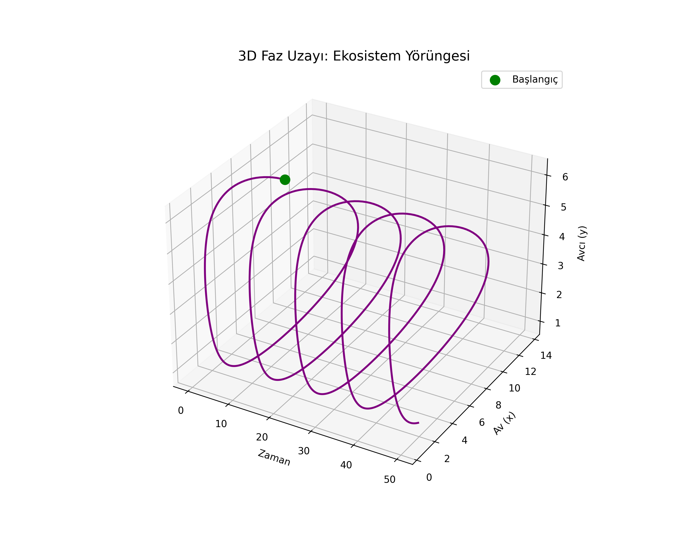
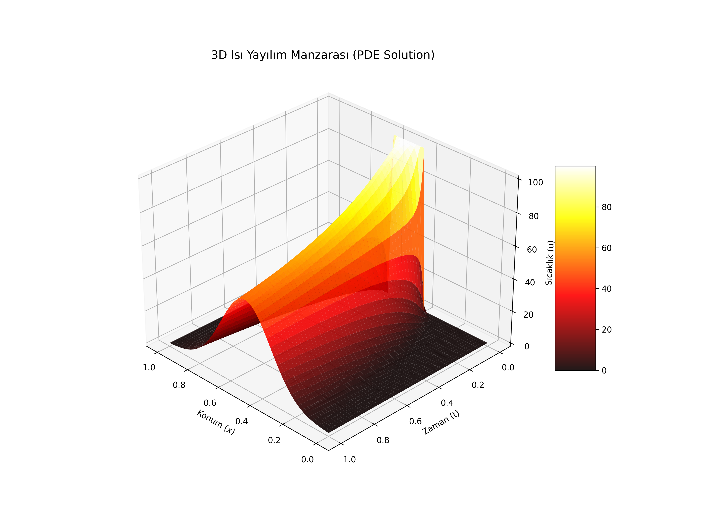
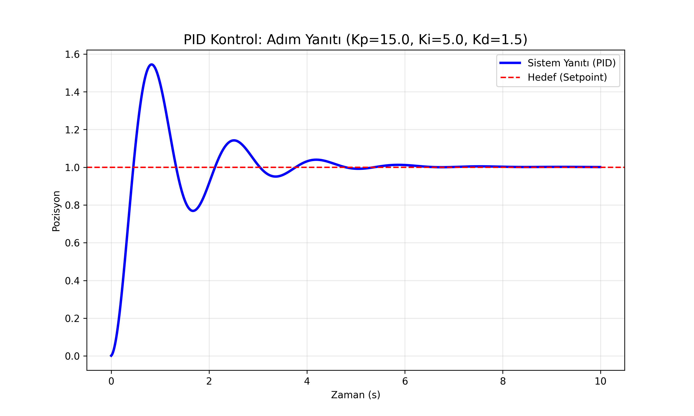

# 🔢 The Mathematical Lab Bench: Computational Framework
> **A Comprehensive 50-Lesson Masterclass in Numerical Analysis, System Dynamics & Scientific Computing**

[](https://www.python.org/)
[]()
[]()
[]()

Welcome to **The Mathematical Lab Bench**. Curated by **Dr. Ozhan Akdag**, this repository is a professional computational laboratory that bridges high-level mathematical theory with robust data intelligence.

---

## 🏛️ The Computational Curriculum (50 Lessons)

This laboratory is structured as a progressive curriculum, moving from foundational calculus to complex partial differential equations and control theory.

### 🧬 Phase V: Differential Dynamics & Numerical Precision
*The most advanced segment of the lab, focusing on high-fidelity simulations.*

* **Numerical Solvers:** Implementation of Euler and **Runge-Kutta (RK4)** with rigorous error analysis.
* **Population Models:** Modeling biological systems via **Logistic Growth** and **Lotka-Volterra** (Predator-Prey).
* **Physics of Diffusion:** Solving the **1D Heat Equation** using finite difference methods.
* **Signal & Control:** System stability analysis through **Fourier** and **Laplace Transforms**, culminating in **PID Control** loops.

### 🏛️ Phases I - IV: Mathematical Pillars
* **Calculus & Analysis:** Integration (Simpson/Trapezoidal), Taylor Series, and Convergence.
* **Statistical Inference:** Gaussian distribution modeling, Z-score outlier detection, and hypothesis testing.
* **Linear Algebra:** Matrix decompositions and vector space computations.

---

## 🖼️ Featured Visual Intelligence
Every simulation in this lab generates separate, high-resolution 2D and 3D assets to ensure mathematical clarity.

| 📉 RK4 Error Surface (Lesson 43) | 🌪️ Predator-Prey Orbit (Lesson 45) |
| :---: | :---: |
|  |  |

| 🌡️ Thermal Diffusion (Lesson 46) | 🎛️ PID System Response (Lesson 50) |
| :---: | :---: |
|  |  |

---

## 🛠️ Technological Stack
* **OS:** Dual-Boot Environment (Fedora Workstation & Windows 11)
* **Core:** Python 3.10+, NumPy, SciPy, SymPy
* **Visuals:** Matplotlib (3D Axes3D engine), Seaborn
* **Data:** Pandas, Scikit-learn

### 📦 Installation
```bash
pip install -r requirements.txt
```

---
<p align="center">
<i>"Where mathematical rigor meets scalable code."</i>
</p>

👨‍🏫 About the Principal Investigator
Dr. Ozhan Akdag is a Doctor of Mathematics and Education with over 20 years of academic experience. Currently based in Doha, Qatar, his work focuses on the intersection of Pure Mathematics, Robotics (Arduino), and Freelance Data Analytics.
