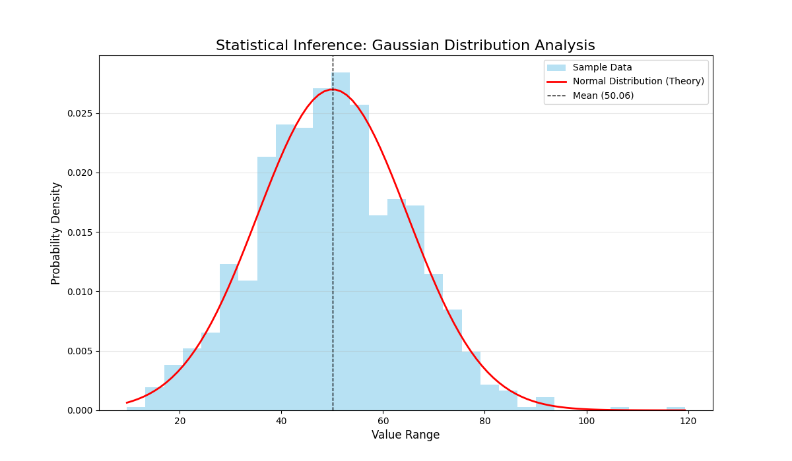

# 🔢 The Mathematical Lab Bench: Computational Framework
> **Advanced Numerical Analysis, Statistical Modeling & Scientific Computing**

Welcome to **The Mathematical Lab Bench**. This repository is a professional computational laboratory curated by **Dr. Ozhan Akdag**. It serves as a bridge between high-level mathematical theory and robust data analytics, providing scalable solutions for complex numerical problems.

---

## 🔬 Core Laboratory Modules

### 📈 I. Advanced Calculus & Numerical Analysis
*Implementation of high-precision mathematical models.*
- **Integration:** Trapezoidal and Simpson's Rule benchmarking.
- **Differential Modeling:** Euler and RK4 methods for dynamical systems.
- **Convergence Analysis:** Taylor and Fourier series visualization.

### 📊 II. Statistical Inference & Data Intelligence
*Ph.D. level statistical validation for predictive analytics.*
- **Distribution Modeling:** Gaussian analysis and Z-score outlier detection.
- **Hypothesis Testing:** Rigorous validation using `SciPy` and `Statsmodels`.
- **Signal Processing:** Noise reduction and trend extraction in time-series data.

### 🤖 III. Applied Robotics & STEM Mathematics
*Computational foundations for automated control systems.*
- **Control Theory:** PID loop modeling and stability analysis.
- **Sensor Fusion:** Mathematical filtering for Arduino-based telemetry.

---

## 🖼️ Featured Analysis: Gaussian Distribution
One of the primary goals of this lab is to transform raw data into statistically sound visual intelligence.

  

> **Interactive Insight:** You can explore the full mathematical proof and the Python implementation in our [Statistical Validation Notebook](./notebooks/Statistical_Validation.ipynb).

> **Note:** The visualization above illustrates an automated Gaussian curve fitting over a stochastic dataset, identifying the probability density function (PDF).

---

## 🛠️ Technological Stack
* **Language:** Python 3.10+
* **Libraries:** `NumPy`, `SciPy`, `Matplotlib`, `Pandas`, `SymPy`
* **Environment:** Linux (Fedora) & Windows 11 Dual-Boot

---

## 👨‍🏫 About the Principal Investigator
**Dr. Ozhan Akdag** is a Doctor of Mathematics and Education with over two decades of experience in academic instruction and data analysis. Currently based in Doha, Qatar, he focuses on the intersection of **Pure Mathematics** and **Computational Automation**.

---

  <i>"Where mathematical rigor meets scalable code."</i>

