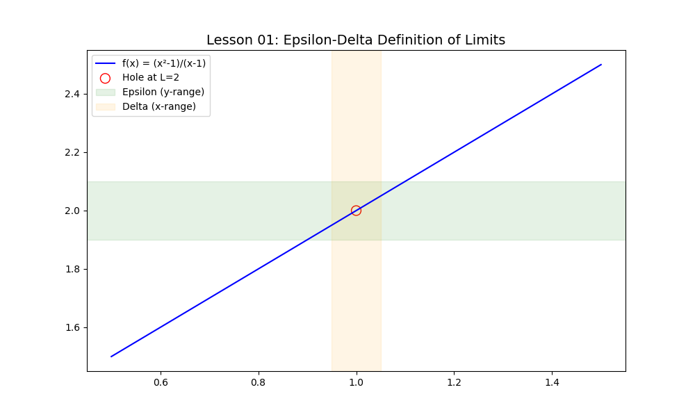

# Lesson 01: Epsilon-Delta Definition of Limits

### 📘 Mathematical Context
The formal definition of a limit is the foundation of Calculus. Instead of saying "x gets close to c", we use the **$\epsilon-\delta$** (Epsilon-Delta) formulation to prove that the function $f(x)$ stays within a specific range.

**Definition:**
$$\forall \epsilon > 0, \exists \delta > 0 \text{ such that } 0 < |x - c| < \delta \implies |f(x) - L| < \epsilon$$

### 💻 Computational Approach
In this lesson, we use **Python (NumPy & Matplotlib)** to visualize this "challenge-response" logic. We define a function with a hole (discontinuity) at $x=1$ and show how choosing a $\delta$ window ensures the function stays within the $\epsilon$ error margin.

### 📊 Visualization

**Key Features of the Script:**
- Handles indeterminate forms like $0/0$.
- Dynamically highlights the $\epsilon$ (y-axis) and $\delta$ (x-axis) neighborhoods.
- Demonstrates why the limit exists even if the point itself is undefined.
