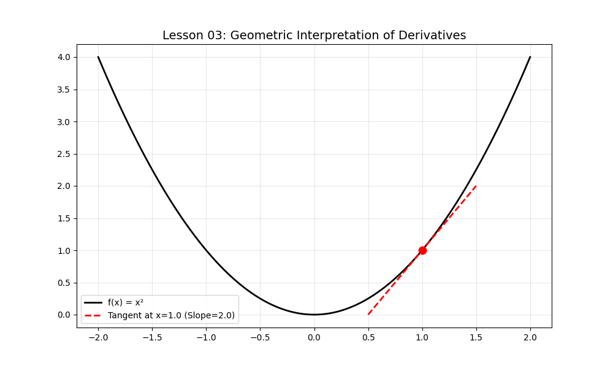

# Lesson 03: The Geometry of Derivatives

### 📘 Mathematical Context
The derivative $f'(x)$ represents the **instantaneous rate of change**. Geometrically, it is the slope of the tangent line to the curve at a given point.

### 💻 Computational Approach
Using the power rule ($d/dx[x^n] = nx^{n-1}$), we calculate the slope at a specific point and plot the linear equation $y - y_1 = m(x - x_1)$ to show the perfect "touch" of the tangent line.

### 📊 Visualization

**Files in this folder:**
* `derivative_analysis.py`: Standalone Python script.
* `derivative_analysis.ipynb`: Interactive Jupyter Notebook.
