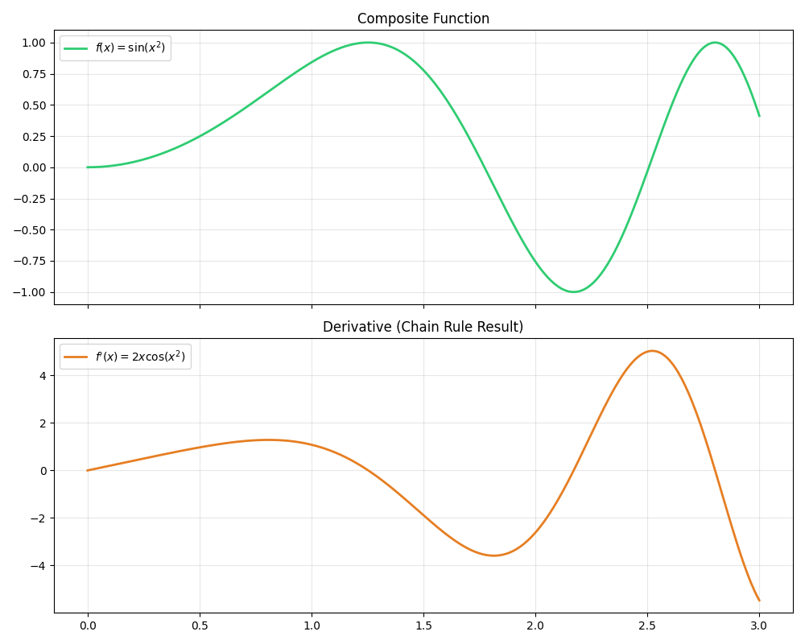

# Lesson 04: Chain Rule in Action

### 📘 Mathematical Context
The **Chain Rule** is the formula for computing the derivative of the composition of two or more functions:
$$\frac{dy}{dx} = \frac{dy}{du} \cdot \frac{du}{dx}$$
It allows us to differentiate complex functions like $f(g(x))$ by breaking them down into simpler "inner" and "outer" parts.

### 💻 Computational Approach
We visualize a composite function (e.g., $\sin(x^2)$) and compare it with its derivative calculated via the Chain Rule ($2x \cdot \cos(x^2)$). This dual-plot helps in understanding how the inner function's rate of change scales the outer function.

### 📊 Visualization

**Files in this folder:**
* `chain_rule_analysis.py`: Standalone Python script.
* `chain_rule_analysis.ipynb`: Interactive Jupyter Notebook.
