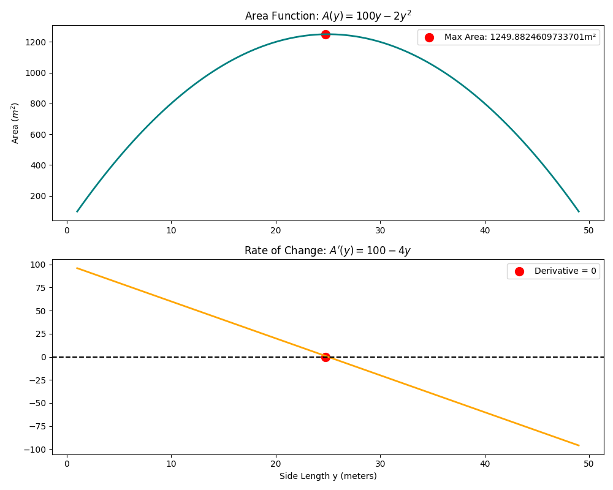

# Lesson 06: Optimization - The Fence Problem

### 📗 What is Optimization?
Optimization is the process of finding the **maximum** or **minimum** value of a function. In real-world engineering and economics, we use this to minimize costs or maximize efficiency.

### 📝 Example Problem: The Rectangular Field
A farmer has **100 meters** of fencing and wants to enclose a rectangular field bordering a straight river (no fence needed along the river). What dimensions will maximize the area?

**Mathematical Solution:**
1.  **Constraint:** $x + 2y = 100$ (where $x$ is the length parallel to the river).
2.  **Objective Function (Area):** $A = x \cdot y$.
3.  **Substitute x:** $A(y) = (100 - 2y) \cdot y = 100y - 2y^2$.
4.  **Derivative:** $A'(y) = 100 - 4y$.
5.  **Critical Point:** $100 - 4y = 0 \implies y = 25m, x = 50m$.
6.  **Max Area:** $1250 m^2$.

### 💻 Computational Approach
The Python script scans the range of possible dimensions, plots the Area Function, and automatically identifies the "Peak" (Global Maximum) using numerical differentiation.

### 📊 Visualization

**Files:**
* `optimization_solver.py`: Scans and finds the maximum area.
* `optimization_solver.ipynb`: Full step-by-step walkthrough.
