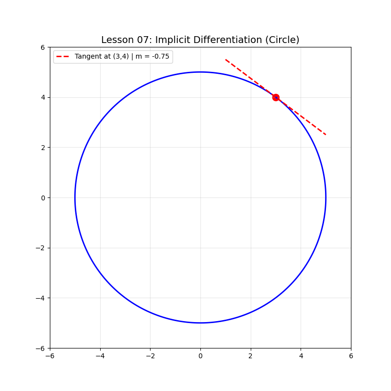

# Lesson 07: Implicit Differentiation

### 📗 What is Implicit Differentiation?
Most functions are **explicit** ($y = f(x)$), but some relations are **implicit**, like the equation of a circle: $x^2 + y^2 = 25$. We cannot easily write $y$ as a single function of $x$. To find the slope ($dy/dx$), we differentiate both sides with respect to $x$, treating $y$ as a function $y(x)$.

### 📝 Example Problem: Slope of a Circle
Find the equation of the tangent line to $x^2 + y^2 = 25$ at the point $(3, 4)$.

**Mathematical Solution:**
1.  $\frac{d}{dx}(x^2 + y^2) = \frac{d}{dx}(25)$
2.  $2x + 2y \cdot \frac{dy}{dx} = 0$
3.  $\frac{dy}{dx} = -\frac{x}{y}$
4.  At $(3, 4)$, $m = -3/4$.

### 💻 Computational Approach
Implicit functions are hard to plot with standard `plt.plot`. We use **Contour Plots** to render the implicit relation and then calculate the vector field or tangent lines at specific points.

### 📊 Visualization

**Files:**
* `implicit_solver.py`: Plots implicit relations and tangents.
* `implicit_solver.ipynb`: Interactive derivation.
