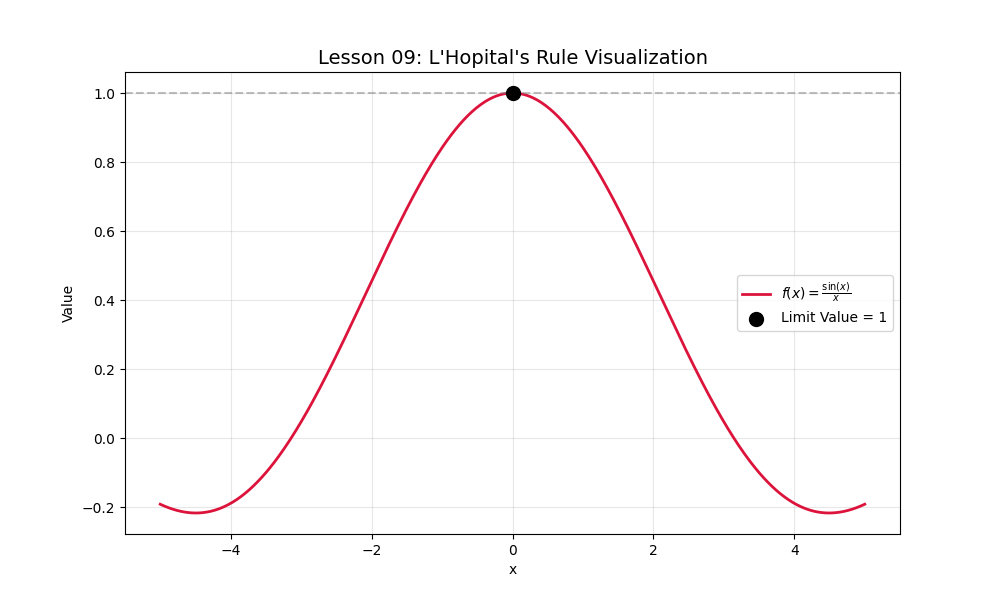

# Lesson 09: L'Hopital's Rule

### 📗 What is L'Hopital's Rule?
When a limit results in an indeterminate form like $0/0$ or $\infty/\infty$, L'Hopital's Rule allows us to take the derivatives of the numerator and denominator to find the limit:
$$\lim_{x \to c} \frac{f(x)}{g(x)} = \lim_{x \to c} \frac{f'(x)}{g'(x)}$$

### 📝 Example Problem
Calculate $\lim_{x \to 0} \frac{\sin(x)}{x}$. 
Direct substitution gives $0/0$. Using L'Hopital:
$\frac{d}{dx}\sin(x) = \cos(x)$ and $\frac{d}{dx}x = 1$.
The limit becomes $\cos(0)/1 = 1$.

### 💻 Computational Approach
We plot the ratio $f(x)/g(x)$ and show how it smoothly approaches the value predicted by L'Hopital's Rule, even though the computer technically encounters a "Not a Number" (NaN) at the exact point.

### 📊 Visualization

**Files:**
* `lhopital_analysis.py`: Visualizes the ratio and its limit.
* `lhopital_analysis.ipynb`: Mathematical proof and simulation.
