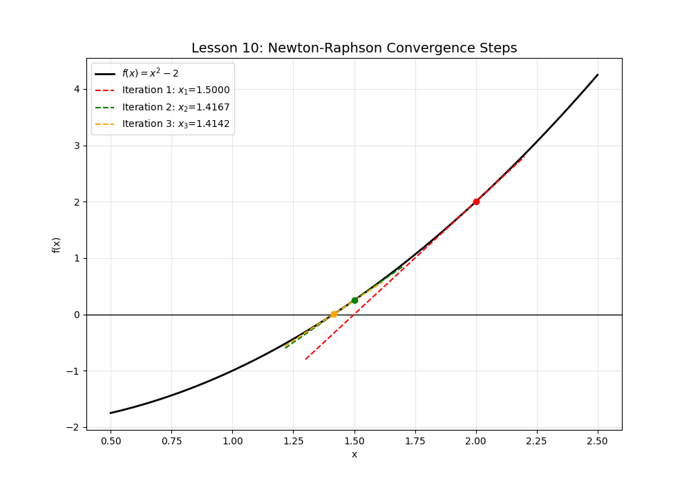

# Lesson 10: Newton-Raphson Method (Root Finding)

### 📗 What is the Newton-Raphson Method?
The **Newton-Raphson Method** is an iterative algorithm used to find the roots (zeros) of a real-valued function $f(x) = 0$. It is one of the most powerful and well-known numerical methods because of its speed (quadratic convergence).

**The Iterative Formula:**
$$x_{n+1} = x_n - \frac{f(x_n)}{f'(x_n)}$$

### 📝 Example Problem: Finding $\sqrt{2}$
To find the square root of 2, we need to find the root of the function:
$$f(x) = x^2 - 2$$
Using an initial guess $x_0 = 2$:
1. $f(2) = 2$ and $f'(2) = 4$
2. $x_1 = 2 - (2/4) = 1.5$
3. $x_2 = 1.5 - (0.25/3) \approx 1.416$
The algorithm converges to $1.414...$ in just a few steps!

### 💻 Computational Approach
The Python script visualizes the "Tangent Steps". It shows how each tangent line's x-intercept brings us closer to the actual root. We use a `for` loop to track and plot each iteration.

### 📊 Visualization

**Files:**
* `newton_solver.py`: Iterative root finder with step-by-step plotting.
* `newton_solver.ipynb`: Full derivation and convergence analysis.
