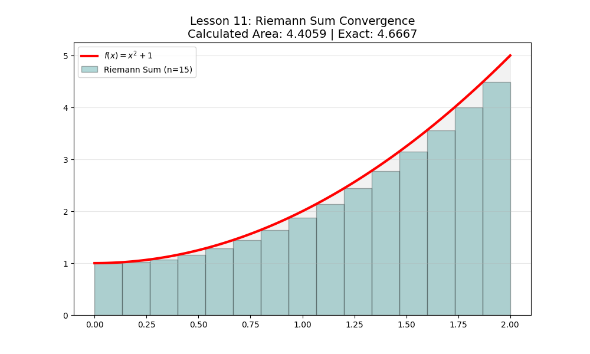

# Lesson 11: Riemann Sums & Convergence Analysis

### 📗 The Core Concept
The definite integral of a function is defined as the limit of **Riemann Sums**. We approximate the area under a curve by dividing it into $n$ rectangles. As $n \to \infty$, the sum of these rectangles converges to the exact integral.

### 📝 Mathematical Challenge: Left vs. Right vs. Midpoint
Consider the function $f(x) = x^2 + 1$ on the interval $[0, 2]$.
1.  **Exact Area:** $\int_{0}^{2} (x^2 + 1) dx = [\frac{x^3}{3} + x]_0^2 = \frac{8}{3} + 2 \approx 4.667$.
2.  **Approximation Error:** How fast does the error decrease as we increase the number of rectangles ($n$)?

### 💻 Computational Approach
This script performs a **comparative analysis**. It plots the function with $n$ rectangles and simultaneously tracks the error margin. This demonstrates the numerical convergence of the integration process.

### 📊 Visualization

**Files:**
* `riemann_solver.py`: Dynamic rectangle generator and error tracker.
* `riemann_solver.ipynb`: Convergence proof with LaTeX.
