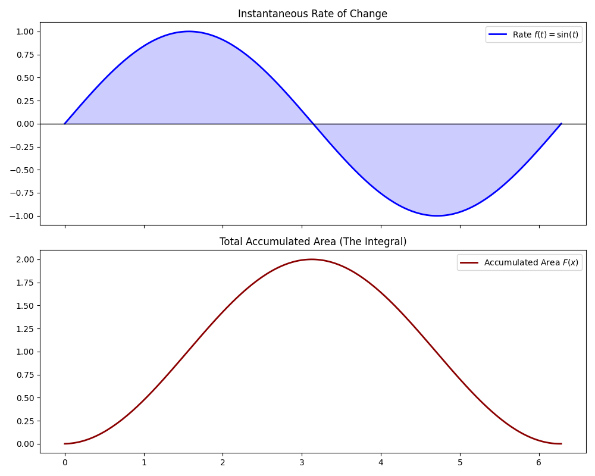

# Lesson 12: The Integral as an Accumulation Function

### 📗 Theoretical Insight
The **Fundamental Theorem of Calculus (Part 1)** states that the integral is an "accumulation" process. If $f(t)$ is a rate of change (e.g., velocity), then $F(x) = \int_a^x f(t) dt$ represents the total accumulated change (e.g., distance).

### 📝 Example: Sine Wave Accumulation
What happens to the total area as we move along a Sine wave?
- From $0$ to $\pi$, the area grows (positive).
- From $\pi$ to $2\pi$, the area shrinks (negative accumulation).

### 💻 Computational Approach
We create a **dual-axis plot** (or subplots). The top plot shows the function $f(t)$, and the bottom plot shows the "Area-so-far" function $F(x)$. This visually proves that the derivative of the accumulation function is the original function: $F'(x) = f(x)$.

### 📊 Visualization

**Files:**
* `accumulation_analysis.py`: Dual-plot visualizer.
* `accumulation_analysis.ipynb`: The link between rate and total change.
