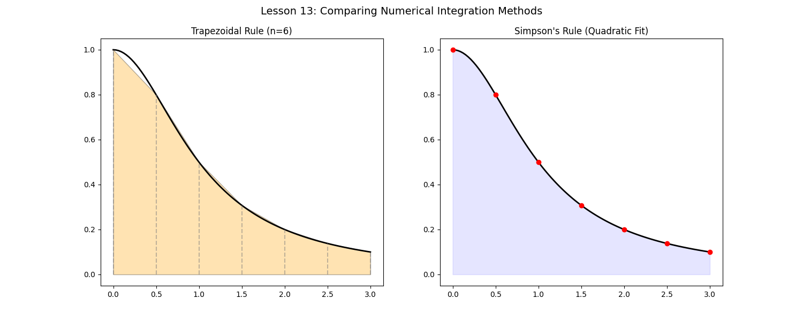

# Lesson 13: Numerical Integration - Efficiency & Error Analysis

### 📗 The Concept
In real-world engineering, many functions cannot be integrated analytically. We use numerical methods. Two of the most common are:
1. **Trapezoidal Rule:** Approximates the area using linear segments (trapezoids).
2. **Simpson's Rule:** Approximates the area using quadratic curves (parabolas).

### 📝 Mathematical Challenge: Which is more accurate?
For a curved function like $f(x) = \frac{1}{1+x^2}$ on $[0, 1]$, Simpson's Rule usually converges much faster than the Trapezoidal Rule for the same number of intervals ($n$).

### 💻 Computational Approach
The script computes the integral using both methods and plots the "geometry of approximation." We visualize how trapezoids cut the curve versus how parabolas "hug" it.

### 📊 Visualization

**Files:**
* `numerical_integrator.py`: Implementation of both rules from scratch.
* `numerical_integrator.ipynb`: Error analysis and Big-O notation of convergence.
