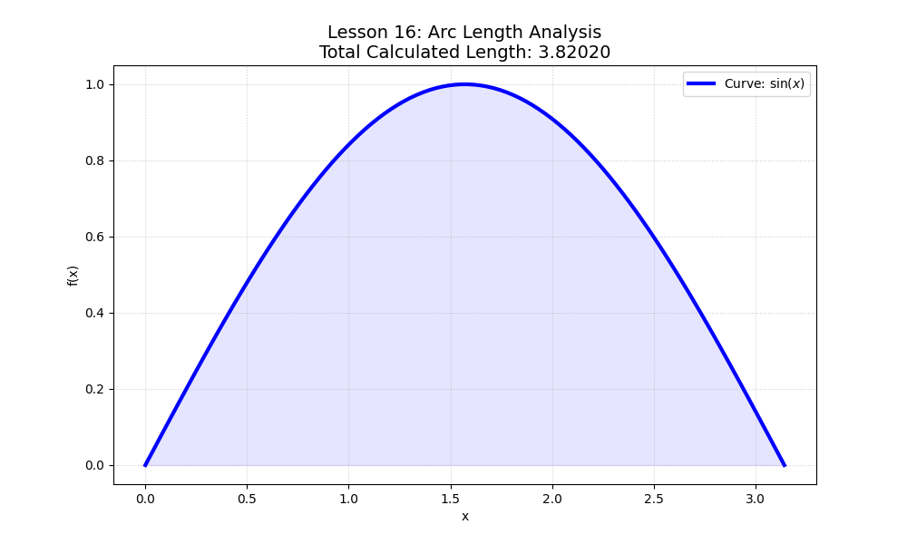

# Lesson 16: Arc Length & Differential Geometry

### 📗 The Concept
How do we measure the exact length of a "curvy" path? In physics, this is the total distance traveled by a particle. Using the Pythagorean theorem on an infinitesimal scale, we derive the **Arc Length Formula**:
$$L = \int_{a}^{b} \sqrt{1 + [f'(x)]^2} dx$$

### 📝 Example: The Catenary or Sine Path
Calculate the length of the sine wave $f(x) = \sin(x)$ from $0$ to $\pi$.
- **Derivative:** $f'(x) = \cos(x)$.
- **Integrand:** $\sqrt{1 + \cos^2(x)}$.
*Note: This integral has no elementary solution (it is an Elliptic Integral), making numerical methods (Python) essential.*

### 💻 Computational Approach
The script computes the derivative symbolically or numerically, then applies **Simpson's Rule** to find the precise length of the curve. It visualizes the curve and highlights the segments used for measurement.

### 📊 Visualization

**Files:**
* `arc_length_solver.py`: Precision length calculator using numerical integration.
* `arc_length_solver.ipynb`: Comparison between linear approximation and calculus.
