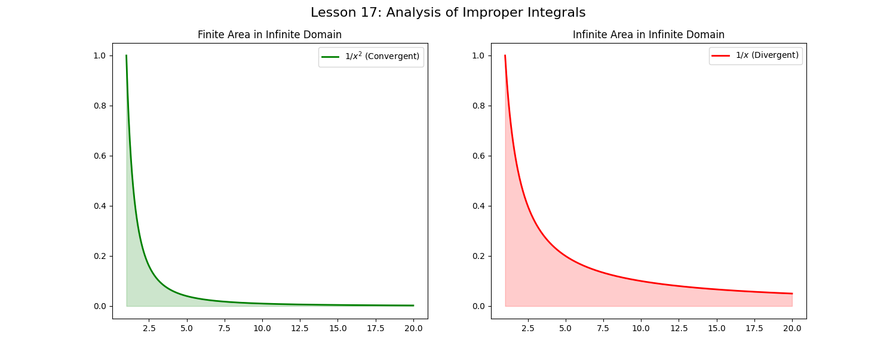

# Lesson 17: Improper Integrals & Asymptotic Convergence

### 📗 Theoretical Framework
An **Improper Integral** is an integral where either the interval of integration is infinite (e.g., $[a, \infty)$) or the integrand becomes infinite within the interval. This concept is vital for Probability Theory (Normal Distribution) and Physics (Potential Energy).

**The Challenge:**
Does the area under a curve that never touches the x-axis remain finite?
$$\int_{1}^{\infty} \frac{1}{x^p} dx$$
- If $p > 1$, it **converges** (finite area).
- If $p \leq 1$, it **diverges** (infinite area).

### 📝 Mathematical Case: Gabriel's Horn Paradox
Consider $f(x) = 1/x$. We analyze the area from $1$ to $A$ as $A \to \infty$. 
- Analytical: $\lim_{A \to \infty} [\ln(x)]_1^A = \infty$.
Now compare it with $g(x) = 1/x^2$:
- Analytical: $\lim_{A \to \infty} [-1/x]_1^A = 1$.

### 💻 Computational Approach
We use Python to compute these integrals numerically and visualize the "tail" of the distribution. We demonstrate how the area accumulates and stays below a certain threshold for convergent functions.

### 📊 Visualization

