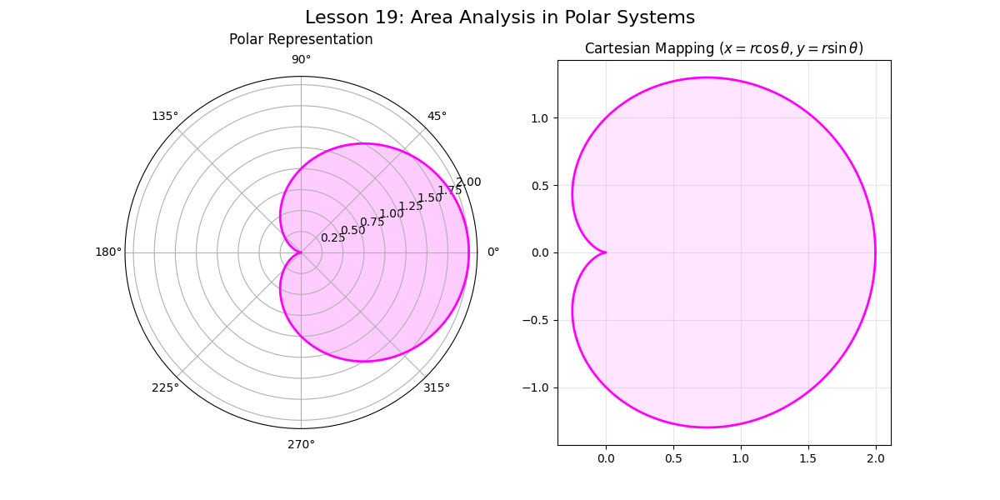

# Lesson 19: Calculus in Polar Coordinates

### 📗 Theoretical Framework
In Cartesian coordinates, we use rectangles. In **Polar Coordinates**, we use circular sectors to measure area. This is the natural language of circular, spiral, and periodic systems.

**Area Formula in Polar Space:**
$$A = \int_{\alpha}^{\beta} \frac{1}{2} [r(\theta)]^2 d\theta$$

### 📝 Mathematical Challenge: The Cardioids and Roses
Find the area enclosed by a **Cardioid** (heart-shaped curve) defined by $r(\theta) = 1 + \cos(\theta)$. This shape is vital in acoustics (microphone pick-up patterns) and antenna theory.

### 💻 Computational Approach
We transform the polar function into Cartesian $(x, y)$ coordinates for plotting but perform the integration in the $\theta$ domain. This shows the bridge between different coordinate systems.

### 📊 Visualization

