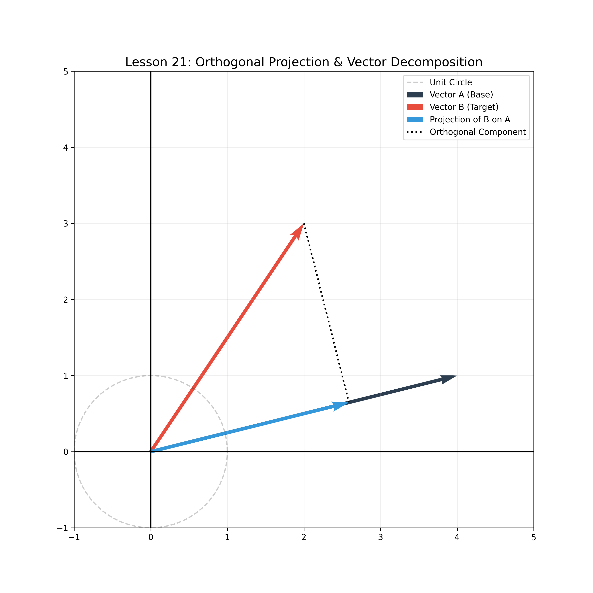

# Lesson 21: Linear Span & Orthogonal Projections

### 📘 Beyond Arrows: The Linear Span
In a 2D Vector Space $\mathbb{R}^2$, a set of vectors doesn't just point somewhere; they "span" a territory. If vectors are linearly independent, they form a **Basis**.

### 📝 Mathematical Challenge: Projection onto a Subspace
How much of vector $\mathbf{b}$ lies in the direction of vector $\mathbf{a}$?
- **Formula:** $proj_{\mathbf{a}}(\mathbf{b}) = \frac{\mathbf{a} \cdot \mathbf{b}}{\|\mathbf{a}\|^2} \mathbf{a}$
- **Application:** This is how noise cancellation works and how we compress data in Signal Processing.

### 💻 Computational Approach
We don't just plot vectors. We visualize the **Projection**, the **Orthogonal Component** (error vector), and the **Unit Circle** to show how scaling affects the space.

### 📊 Visualization

