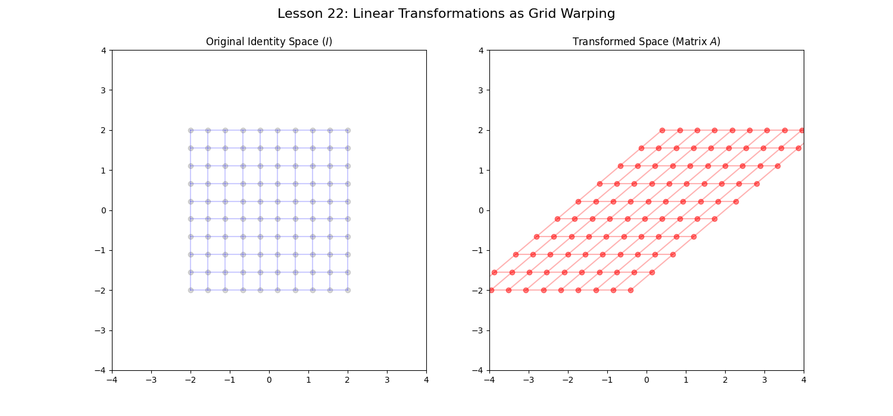

# Lesson 22: Matrix Transformations & Determinant Logic

### 📘 The Geometry of Determinants
The **Determinant** of a matrix isn't just a number; it is the **Area Scaling Factor**. 
- If $det(A) = 2$, the area of any shape doubles.
- If $det(A) = 0$, the entire 2D space collapses into a 1D line (Singularity).

### 📝 Example: The Singular Value Transformation
We apply a transformation matrix $A$ to a **Circular Distribution** of points. This reveals the "Principal Axes" of the transformation, leading us directly toward **Eigenvalues** and **SVD**.

### 💻 Computational Approach
We use a color-coded "Unit Square" and "Unit Circle". As the matrix $A$ is applied, we watch how the colors spread and rotate, making the abstract math feel like a physical "stretching" of a rubber sheet.

### 📊 Visualization

