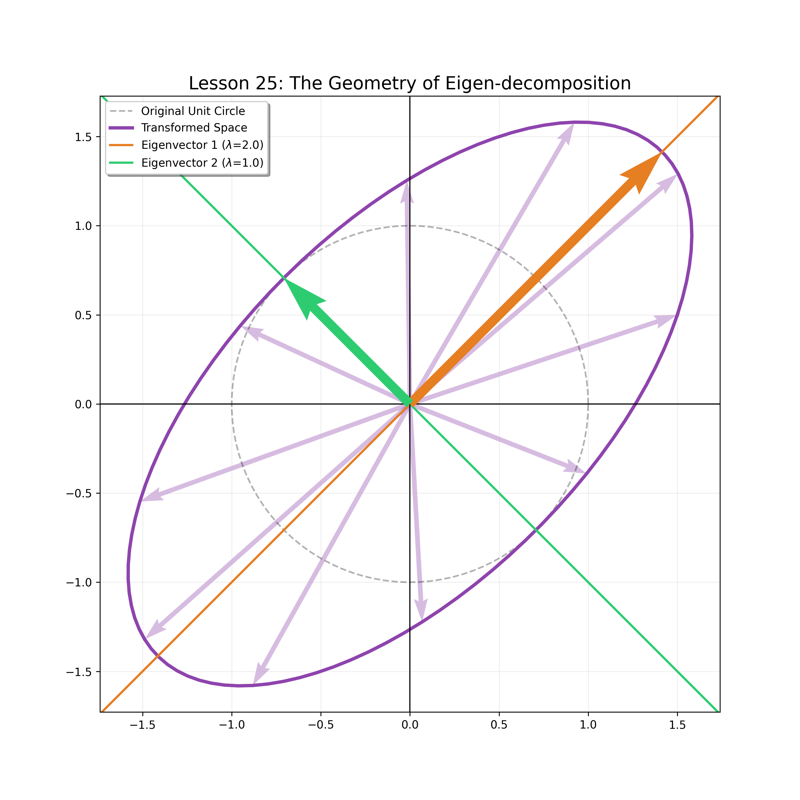
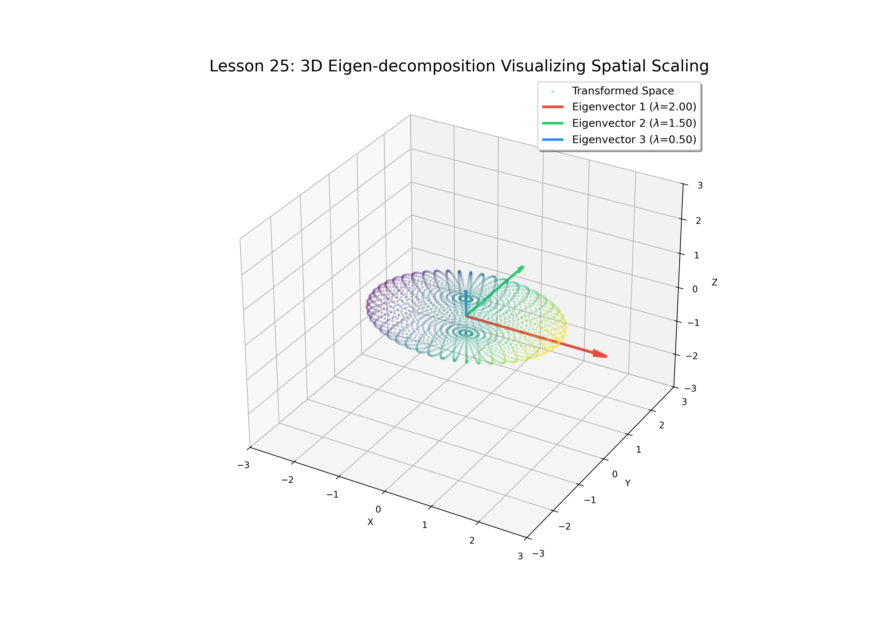

# Lesson 25: Eigen-Decomposition - From Planar Geometry to Spatial Dynamics

### 📗 The Core Philosophy
In Linear Algebra, an **Eigenvector** is a "characteristic" direction of a linear transformation. While most vectors change their direction when multiplied by a matrix $A$, eigenvectors remain on their own span. They represent the **intrinsic axes** of a system's behavior.

$$A\mathbf{v} = \lambda\mathbf{v}$$

### 📝 Dimensional Evolution: Why 2D and 3D?
To truly understand the "Eigen-phenomenon," we must observe it across different dimensions:

1.  **2D Interpretation (The Rubber Sheet):** In two dimensions, we visualize how a unit circle is stretched into an ellipse. The eigenvectors are the major and minor axes of this ellipse. It is the foundation for understanding **Principal Component Analysis (PCA)**.
2.  **3D Interpretation (The Volume Warp):** In three dimensions, we see how a sphere evolves into an ellipsoid. This is critical for **Robotics and Aerodynamics**, where we analyze stability and stress along three orthogonal axes (Yaw, Pitch, Roll).

---

### 💻 Computational Approach
We provide two distinct visualization engines:
* `eigen_visualizer_2d.py`: Focuses on the "Invariant Lines" and the unit circle transformation.
* `eigen_visualizer_3d.py`: Utilizes `mplot3d` to render a point cloud transformation, highlighting the three spatial eigen-axes.

### 📊 Visual Evidence

#### I. 2D Planar Transformation
The orange and green lines represent the eigenvectors. Note how the unit circle stretches along these exact directions.

#### II. 3D Spatial Scaling
In 3D, we visualize the transformation of a spherical volume. The RGB-coded arrows represent the three eigenvectors, defining the "Principal Directions" of the spatial warp.

---

### 🎓 Ph.D. Insight: Stability & Resonance
From an educational standpoint, the **Eigenvalues** ($\lambda$) tell us the "Magnitude of Influence" in each direction. 
- If $|\lambda| > 1$, the system expands (potential instability).
- If $|\lambda| < 1$, the system contracts (convergence/stability).
This dual-dimension analysis proves that regardless of the complexity of the space, the underlying logic of "invariant directions" remains the ultimate key to system analysis.

**Files:**
* `eigen_visualizer_2d.py`: 2D Geometric engine.
* `eigen_visualizer_3d.py`: 3D Spatial simulator.
* `eigen_analysis.ipynb`: Mathematical proof of the Characteristic Equation.
