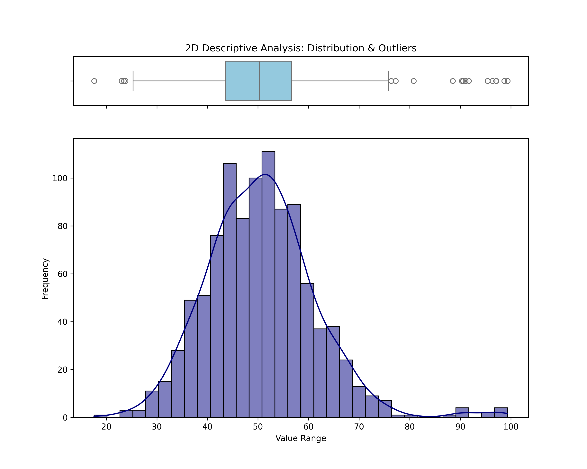
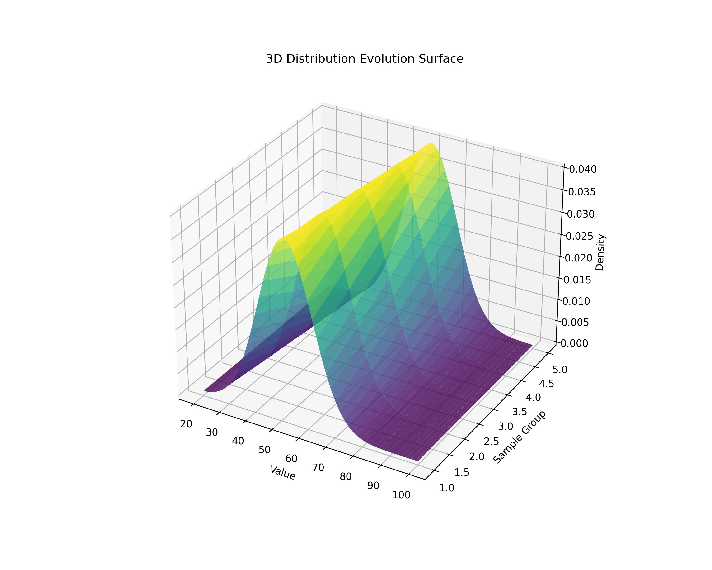

# Lesson 31: Descriptive Statistics - The Character of Data

### 📗 Beyond the Mean
Descriptive statistics provides the essential summary of a dataset. To truly understand data, we must look beyond the average and analyze its **Spread** (Variance, Standard Deviation) and its **Shape** (Skewness, Kurtosis).

### 📝 The Statistical Toolkit
1.  **Central Tendency:** Mean, Median, and Mode.
2.  **Dispersion:** Range, Variance, and Standard Deviation ($\sigma$).
3.  **Shape Analysis:** - **Skewness:** Is the data leaning left or right?
    - **Kurtosis:** Is the peak sharp or flat?

---

### 💻 Computational Approach: The Triple-Asset Engine
This lesson utilizes a robust Python pipeline to analyze a generated dataset. We produce three distinct perspectives:
* **2D Perspective:** A combined Histogram and Box-Plot to see outliers and density simultaneously.
* **3D Perspective:** A "Frequency Landscape" showing how data distribution evolves across different samples.
* **Master Dashboard:** A unified view for professional data reporting.

### 📊 Visual Evidence

#### I. 2.5D Distribution & Outliers
Visualizing the Interquartile Range (IQR) and the density of observations.

#### II. 3.3D Density Surface
A spatial representation of data frequency across multiple observation windows.

**Files:**
* `stats_pipeline_master.py`: The core engine generating all assets and the dashboard.
