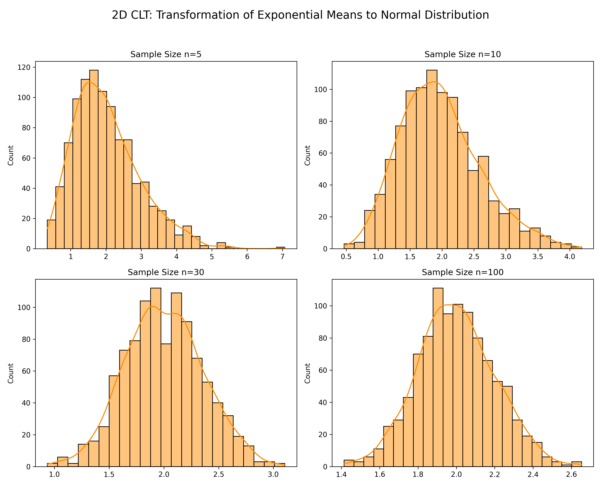
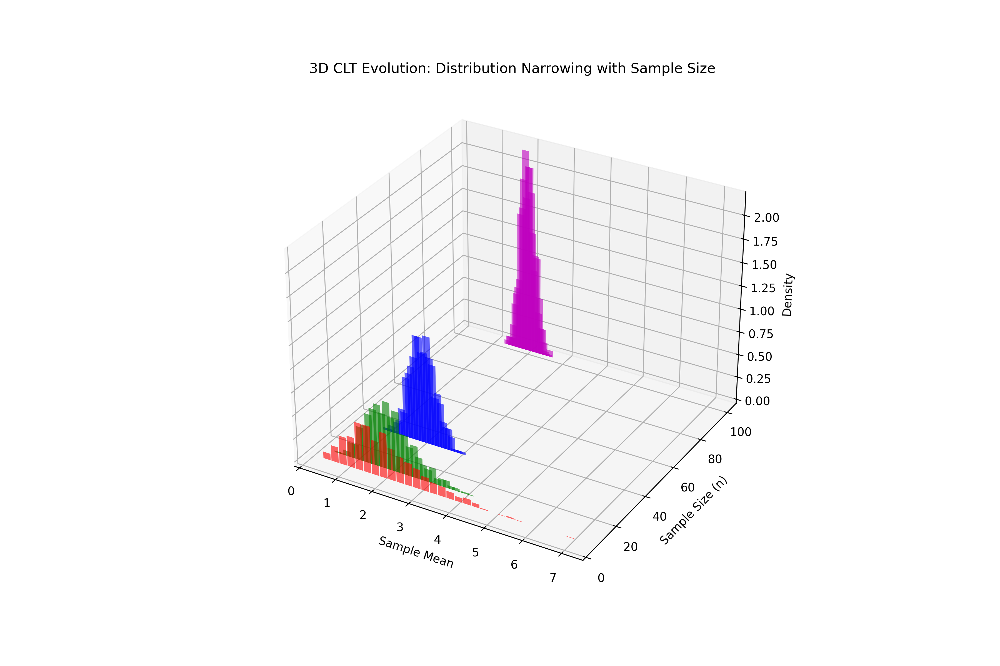

# Lesson 32: Central Limit Theorem - Order from Chaos

### 📗 The Statistical Miracle
The **Central Limit Theorem (CLT)** states that if you take sufficiently large samples from any population with a finite variance, the distribution of the **sample means** will be normally distributed, regardless of the population's original distribution.

### 📝 Key Mechanics
1. **Sampling:** We draw multiple samples from a highly skewed (Non-Normal) distribution.
2. **Averaging:** We calculate the mean of each sample.
3. **Convergence:** As the number of samples increases, the histogram of these means transforms into a perfect Gaussian Bell Curve.

---

### 💻 Computational Approach: The Dual-Asset Engine
To visualize this "transformation," we use a hybrid simulation:
* **2D Perspective:** Shows the evolution from the "Original Distribution" to the "Mean Distribution" (Bell Curve).
* **3D Perspective:** A spatial "Time-Series" of histograms, showing the distribution narrowing and centering as sample size grows.

### 📊 Visual Evidence

#### I. 2D Convergence Analysis
Note how the messy original data (Uniform/Exponential) becomes a smooth Normal Curve in the bottom plot.

#### II. 3D Distribution Evolution
Visualizing the "Birth of a Bell Curve" across different sample sizes.

**Files:**
* `clt_simulation_master.py`: The simulation engine for sampling and visualization.
