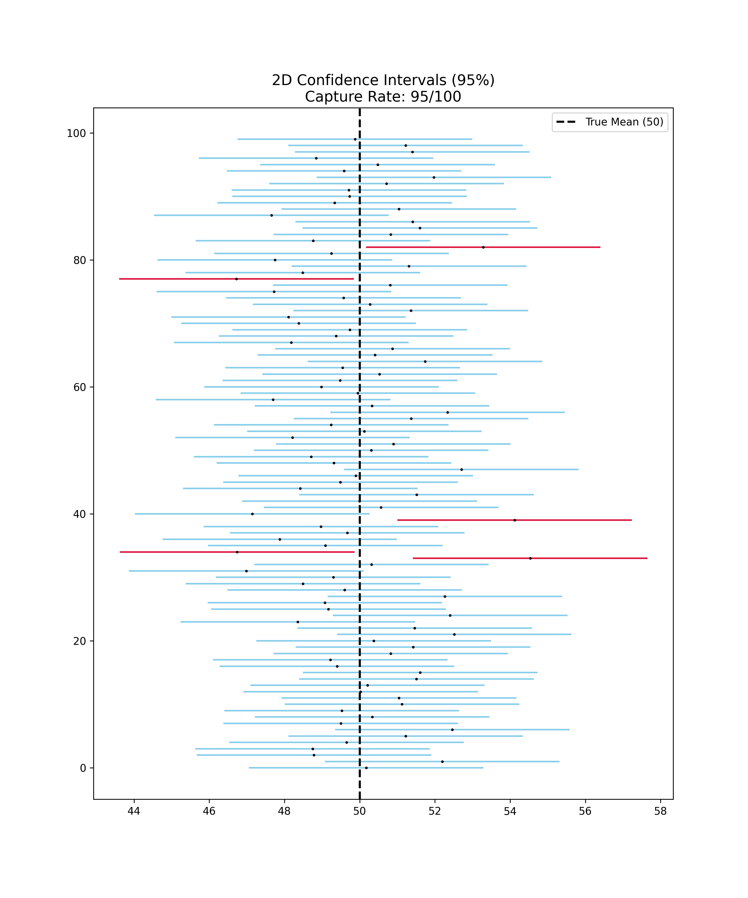
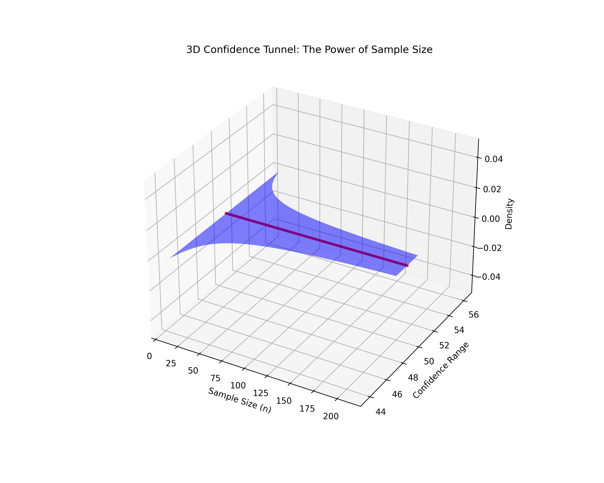

# Lesson 33: Confidence Intervals - The Margin of Error

### 📗 Measuring Uncertainty
In statistics, a **Confidence Interval (CI)** provides a range of values which is likely to contain the true population parameter. It is not just a guess; it is an interval calculated from sample data with a specific **Confidence Level** (usually 95%).

### 📝 The Statistical Core
For a population mean $\mu$, the interval is:
$$\bar{x} \pm z^* \left( \frac{\sigma}{\sqrt{n}} \right)$$
- **$\bar{x}$:** Sample mean (The point estimate).
- **$z^* \left( \frac{\sigma}{\sqrt{n}} \right)$:** The Margin of Error.
- **Interpretation:** If we repeat the experiment 100 times, we expect 95 of those intervals to capture the true population mean.

---

### 💻 Computational Approach: The Triple-Asset Engine
We simulate "100 parallel worlds" to visualize how confidence works:
* **2D Perspective:** 100 vertical intervals plotted against the true mean, highlighting the "misses" (the 5% that fail).
* **3D Perspective:** A "Confidence Tunnel" showing how the width of the interval shrinks as sample size or confidence levels change.
* **Master Dashboard:** A unified view of estimation and uncertainty.

### 📊 Visual Evidence

#### I. 2D Interval Capture Analysis
The horizontal lines represent individual samples. Note the red lines that fail to cross the population mean—the visual proof of the 5% error.

#### II. 3D Uncertainty Landscape
A spatial view of the relationship between sample size, variance, and interval width.

**Files:**
* `confidence_intervals_master.py`: Unified simulation and asset generator.
