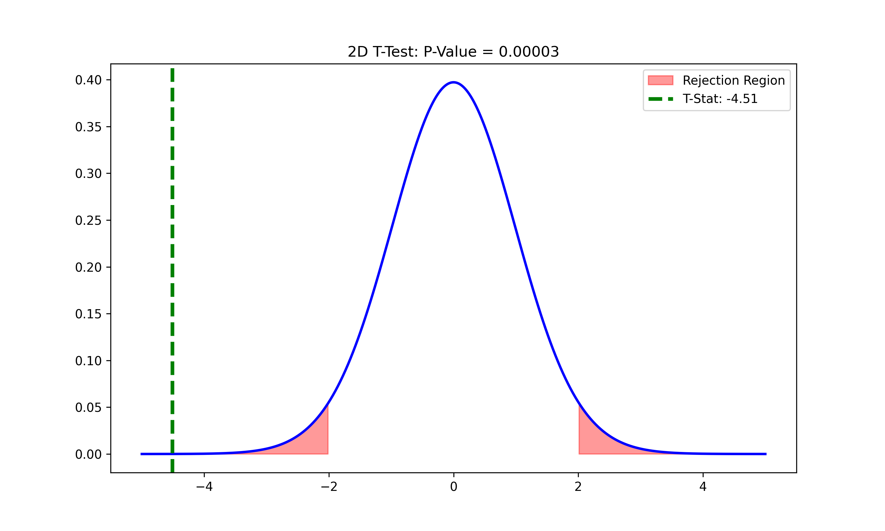
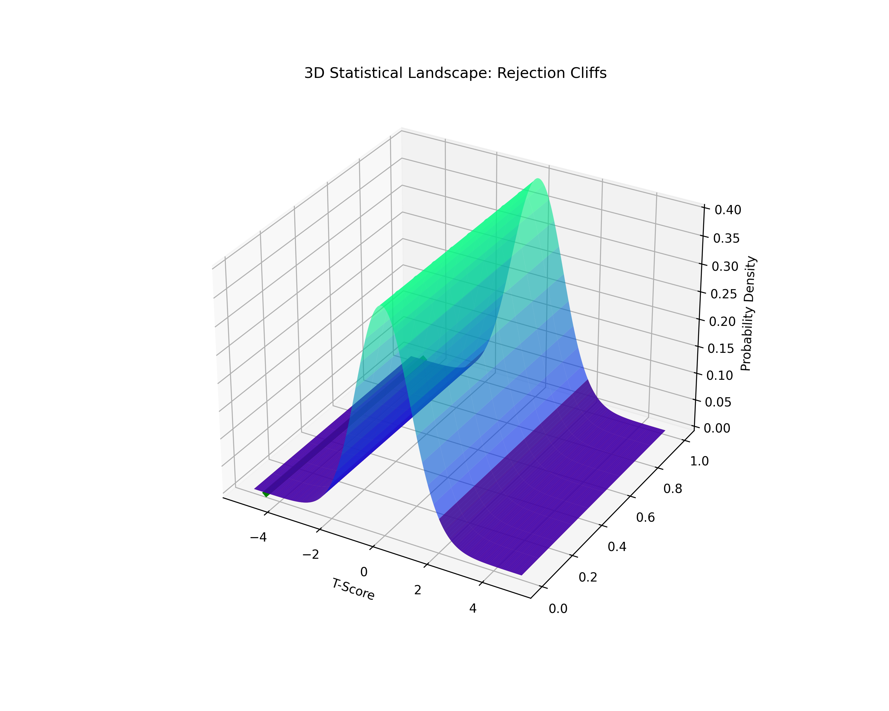

# Lesson 34: Hypothesis Testing - The Statistical Courtroom

### 📗 The Geometry of the Decision
Hypothesis testing is about determining if an observed difference is "large enough" to be real. 

- **2D Perspective:** We look at the T-distribution "from the side" to see if our T-score falls into the shaded red tails (rejection regions).
- **3D Perspective:** We visualize the entire "Probability Mountain." The rejection regions are the steep cliffs at the edges. Our T-score is a "flag" placed on this mountain.

---

### 📊 Visual Evidence (Mirroring 2D & 3D)

#### I. 2D Decision Zone
The green line shows where our sample stands. Since it's inside the red zone, the difference is significant.

#### II. 3D Decision Landscape
A spatial view of the same distribution. The "Red Cliffs" represent the 5% threshold in 3D space.

**Files:**
* `hypothesis_testing_master.py`: The unified engine with consistent 2D/3D mapping.
