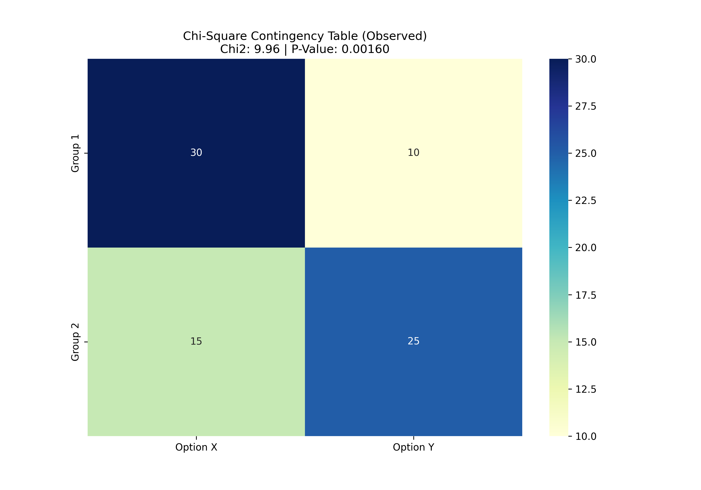
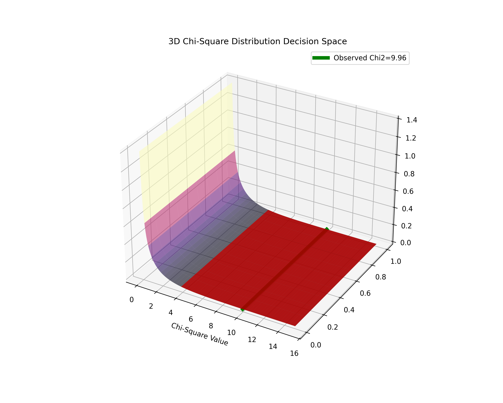

# Lesson 36: Chi-Square Test - Independence & Goodness of Fit

### 📗 The Logic of Categorical Analysis
The **Chi-Square ($\chi^2$)** test determines if there is a significant association between two categorical variables. For example: "Does the choice of a programming language depend on the user's operating system?"

### 📝 Observed vs. Expected
The test compares the **Observed (O)** frequencies in our data to the **Expected (E)** frequencies we would see if there were absolutely no relationship between the variables:
$$\chi^2 = \sum \frac{(O_i - E_i)^2}{E_i}$$

- **Null Hypothesis ($H_0$):** The variables are independent (no relationship).
- **Alternative Hypothesis ($H_a$):** The variables are dependent (a relationship exists).

---

### 💻 Computational Approach: The Unified Asset Engine
1. **2D Perspective:** A "Heatmap" of the Contingency Table and a "Grouped Bar Chart" comparing Observed vs. Expected values.
2. **3D Perspective:** The Chi-Square distribution surface, highlighting the "Tail of Significance."
3. **Master Dashboard:** A full report including the Chi-Square statistic and p-value.

### 📊 Visual Evidence

#### I. 2.5D Categorical Heatmap
Visualizing the concentration of data across categories.

#### II. 3D Chi-Square Distribution
The unique shape of the $\chi^2$ distribution which, unlike the Normal curve, is always positive and right-skewed.

**Files:**
* `chisq_master.py`: Unified engine for categorical testing and separate asset generation.
