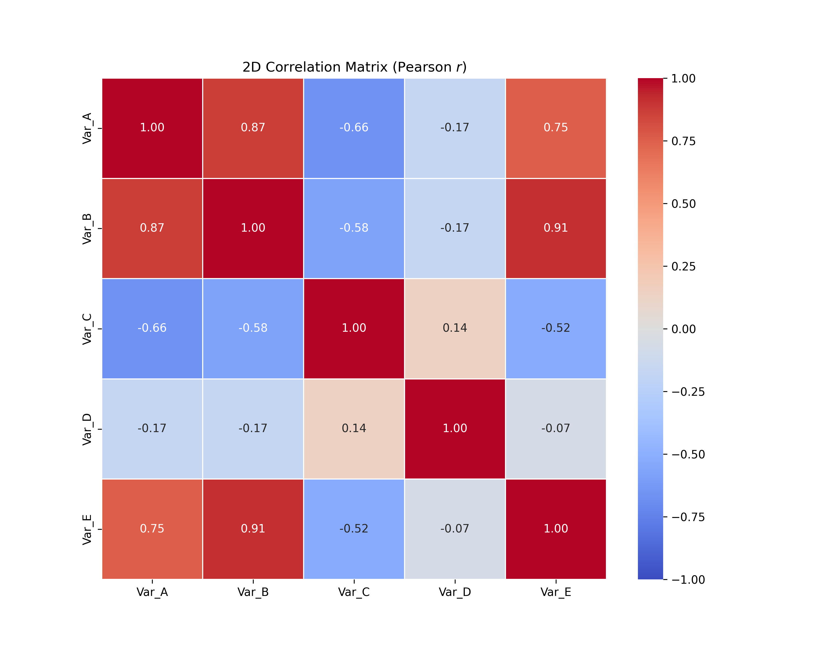
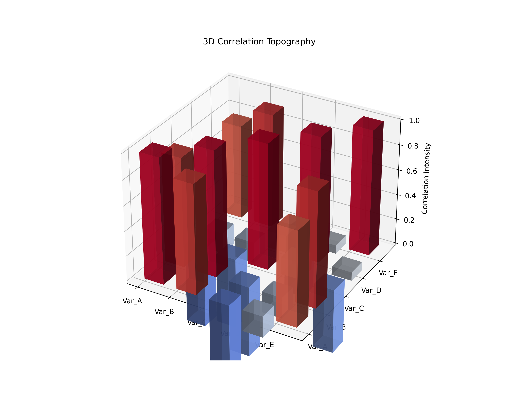

# Lesson 37: Correlation Heatmaps - Relationships in Data

### 📗 The Pearson Correlation Coefficient ($r$)
Correlation measures the strength and direction of the linear relationship between two variables. 
- **$r = 1$:** Perfect positive correlation (Move together).
- **$r = -1$:** Perfect negative correlation (One goes up, other goes down).
- **$r = 0$:** No linear relationship.

### 📝 The Power of the Heatmap
When dealing with multidimensional data (many columns), checking pairs one by one is impossible. A **Correlation Heatmap** allows us to see the "big picture" by mapping the correlation matrix into a color-coded grid.

---

### 💻 Computational Approach: The Unified Asset Engine
1. **2D Perspective:** A professional **Seaborn Heatmap** with numerical annotations and a diverging color palette (Coolwarm).
2. **3D Perspective:** A **Correlation Surface**, where the "peaks" represent high positive correlation and the "valleys" represent negative correlation.
3. **Master Dashboard:** A dual-view for spotting hidden patterns instantly.

### 📊 Visual Evidence

#### I. 2D Correlation Matrix
High values (red) indicate strong positive relationships, while low values (blue) indicate inverse relationships.

#### II. 3D Relationship Topography
Visualizing the matrix as a 3D landscape where the height represents the strength of the correlation.

**Files:**
* `correlation_master.py`: Unified engine for matrix calculation and separate asset generation.
