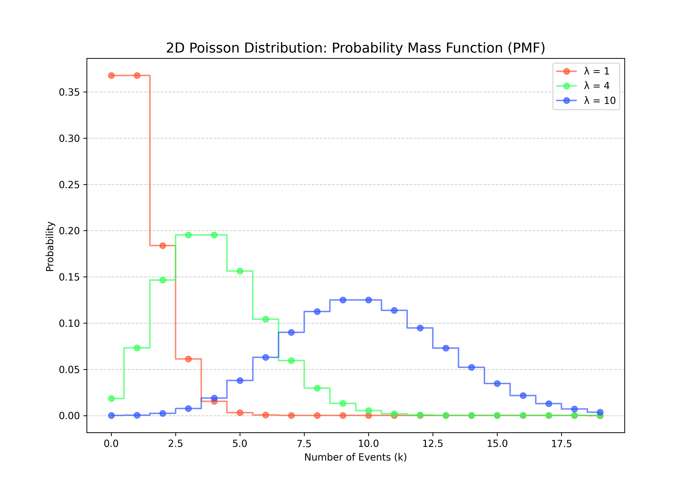
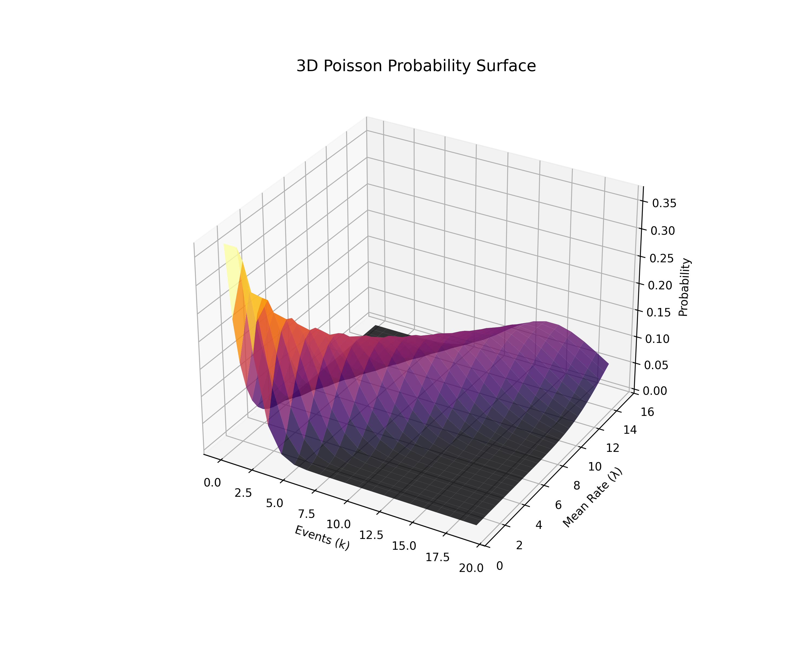

# Lesson 38: Poisson Distribution - The Probability of Occurrence

### 📗 Definition
The **Poisson Distribution** expresses the probability of a given number of events occurring in a fixed interval of time or space, provided these events occur with a known constant mean rate ($\lambda$) and independently of the time since the last event.

### 📝 The Mathematical Formula
The probability of observing $k$ events is given by:
$$P(k; \lambda) = \frac{\lambda^k e^{-\lambda}}{k!}$$
- **$\lambda$:** The average number of events per interval (Expected value).
- **$k$:** The actual number of events we want to find the probability for.
- **$e$:** Euler's number.

---

### 💻 Computational Approach: The Unified Asset Engine
1. **2D Perspective:** A "Probability Mass Function" (PMF) showing how the peak of the distribution shifts as the average rate ($\lambda$) increases.
2. **3D Perspective:** A "Temporal Probability Surface" showing the evolution of probabilities across different time scales and event rates.
3. **Master Dashboard:** Comparing different $\lambda$ values to visualize the "normalization" of Poisson.

### 📊 Visual Evidence

#### I. 2D PMF Curves
As $\lambda$ increases, the distribution starts to look more like a Normal (Gaussian) curve.

#### II. 3D Poisson Surface
Visualizing how the probability density changes as both the number of events ($k$) and the rate ($\lambda$) evolve together.

**Files:**
* `poisson_master.py`: Unified engine for distribution modeling and separate asset generation.
