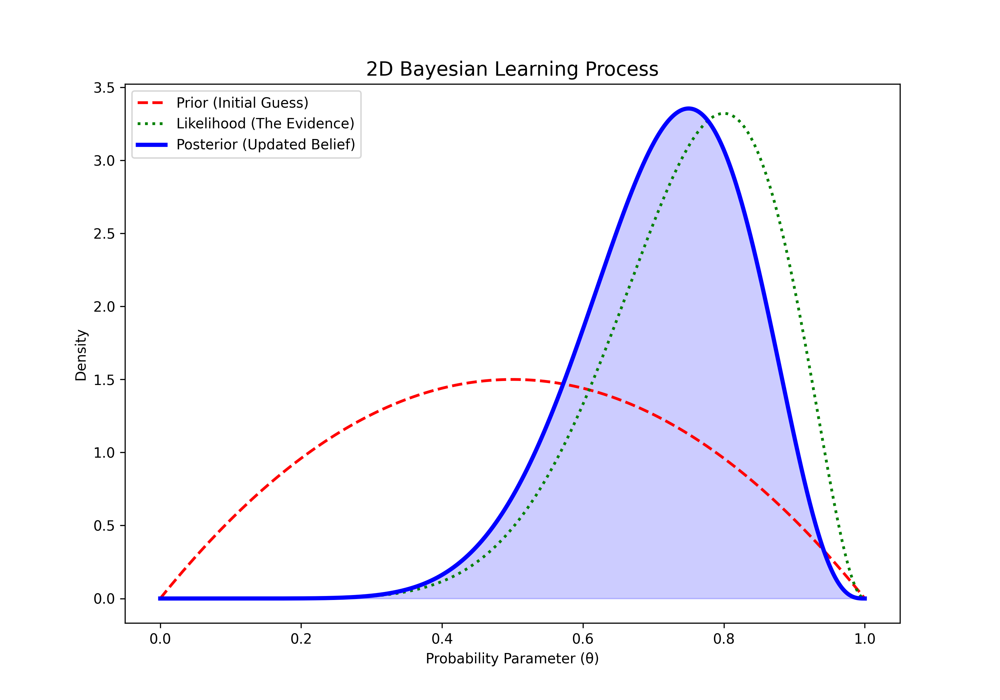
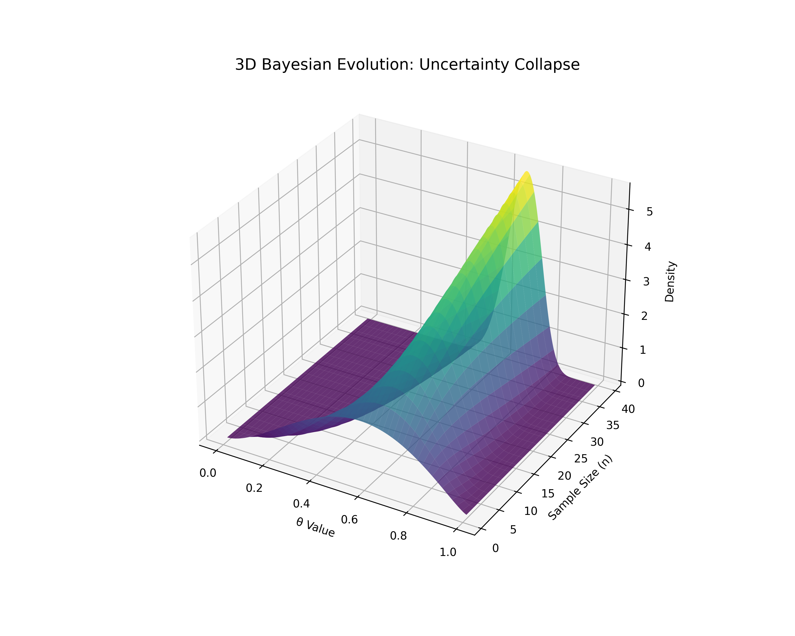

# Lesson 39: Bayesian Inference - The Power of Priors

### 📗 The Bayesian Formula
Bayesian inference uses Bayes' Theorem to update the probability for a hypothesis as more evidence or information becomes available:
$$P(H|E) = \frac{P(E|H) \cdot P(H)}{P(E)}$$
- **$P(H|E)$ (Posterior):** New probability of hypothesis $H$ after seeing evidence $E$.
- **$P(E|H)$ (Likelihood):** Probability of seeing evidence $E$ if hypothesis $H$ is true.
- **$P(H)$ (Prior):** Initial belief about hypothesis $H$ before seeing any evidence.
- **$P(E)$ (Evidence):** Total probability of the evidence.

### 📝 The Learning Loop
Bayesian statistics is an iterative process. Today's **Posterior** becomes tomorrow's **Prior** as we collect more data.

---

### 💻 Computational Approach: The Unified Asset Engine
1. **2D Perspective:** A visual comparison of the **Prior** (what we thought), the **Likelihood** (what the data says), and the **Posterior** (our updated belief).
2. **3D Perspective:** A "Belief Evolution Surface" showing how the posterior distribution narrows and shifts as the sample size increases.
3. **Master Dashboard:** A step-by-step visualization of "Learning from Data."

### 📊 Visual Evidence

#### I. 2D Bayesian Update
The transition from a broad initial guess (Prior) to a sharpened updated belief (Posterior) after observing data.

#### II. 3D Posterior Evolution
Visualizing how uncertainty collapses into certainty as we gather more evidence over time.

**Files:**
* `bayesian_master.py`: Unified engine for Bayesian modeling and separate asset generation.
