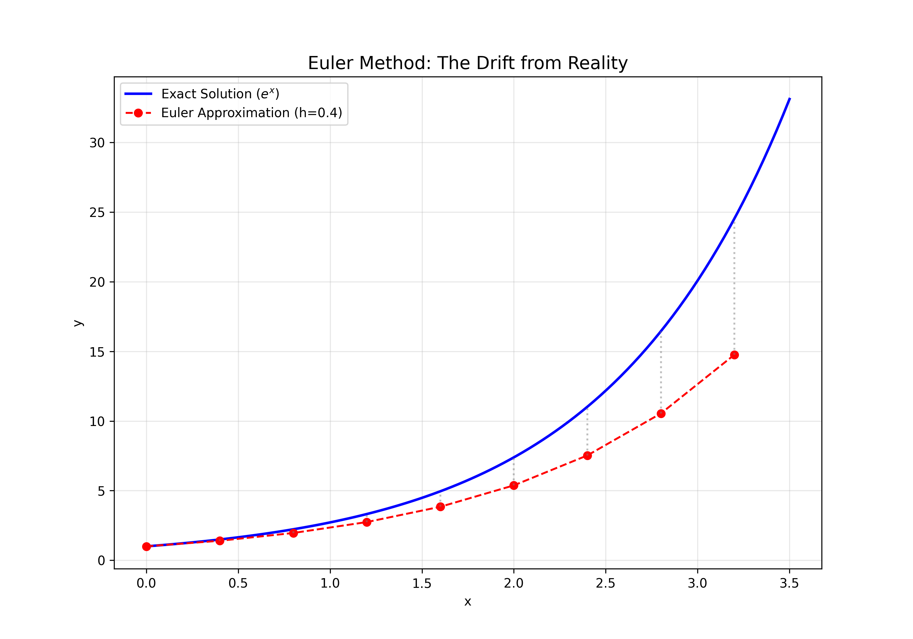
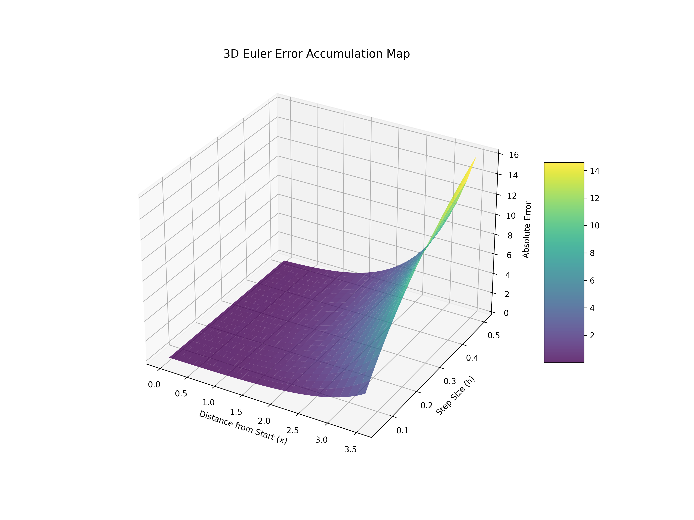

# Lesson 42: Euler Method - The First Step into Numerics

### 📗 The Core Idea
Euler's Method is a first-order numerical procedure for solving ordinary differential equations (ODEs) with a given initial value. It uses the tangent line at the current point to estimate the next point.

### 📝 The Iterative Formula
Given $\frac{dy}{dx} = f(x, y)$ and an initial point $(x_0, y_0)$:
$$y_{n+1} = y_n + h \cdot f(x_n, y_n)$$
$$x_{n+1} = x_n + h$$
- **$h$:** The step size. Smaller $h$ means better accuracy but more computation.
- **$f(x_n, y_n)$:** The slope at the current point.

---

### 💻 Computational Approach: The Error Analysis Engine
1. **2D Perspective:** Comparing the **Analytical Solution** (Exact) with the **Euler Approximation** (Numerical). We will see how the "drift" occurs as errors accumulate.
2. **3D Perspective:** Visualizing the **Error Surface**. How does the approximation error grow as a function of the step size ($h$) and total distance from the start?
3. **Master Dashboard:** Interactive visualization of the step-by-step approximation process.

### 📊 Visual Evidence

#### I. 2D Approximation Drift
Observe how the Euler method (dots) tries to follow the curve but gradually deviates due to local truncation errors.

#### II. 3D Error Accumulation
A 3D landscape where the height (Z) represents the absolute error between the exact solution and Euler's estimation over time.

**Files:**
* `euler_method_master.py`: Unified engine for step-by-step approximation and error mapping.
