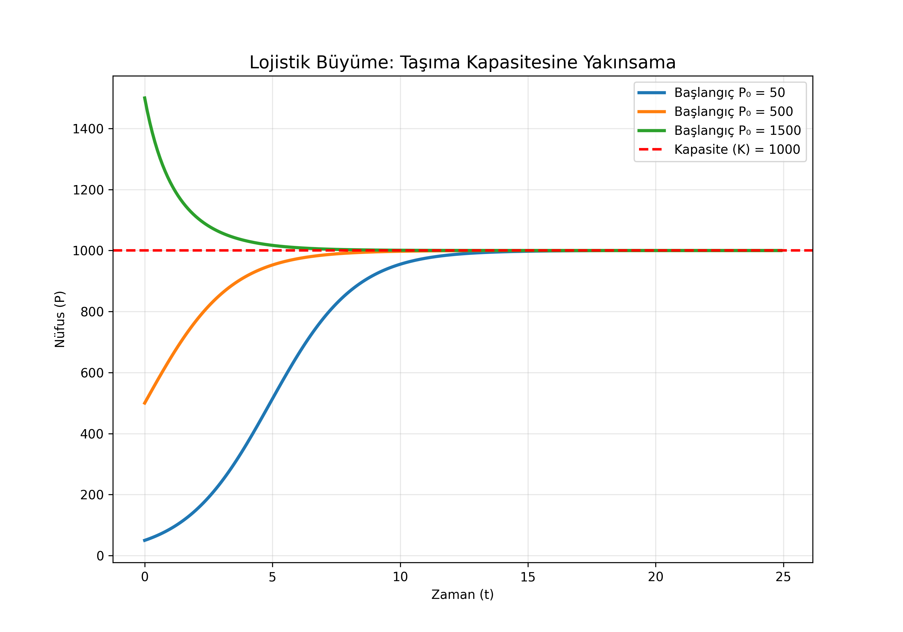
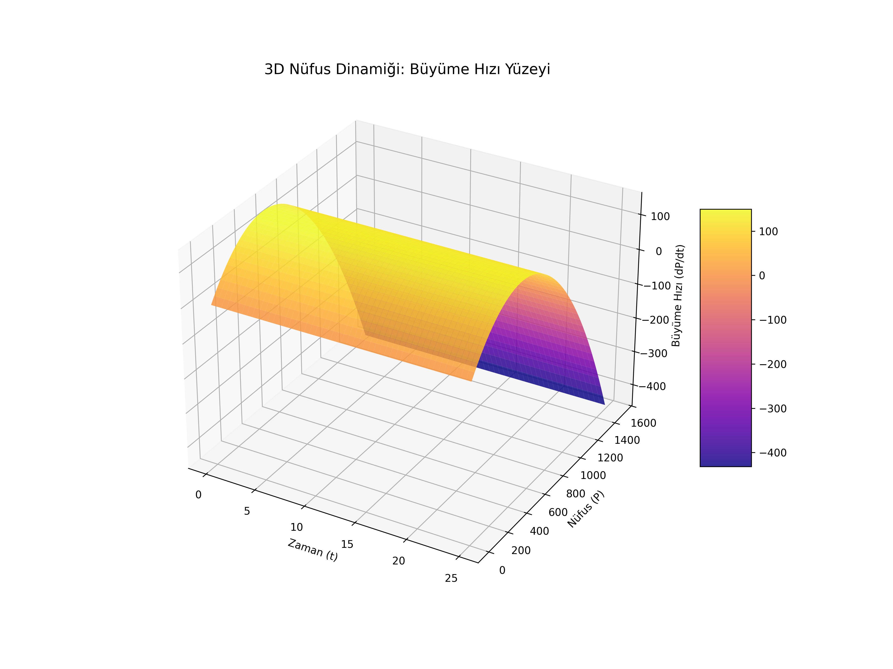

# Lesson 44: Logistic Growth - Modeling Population Limits

### 📗 The Logistic Equation
Unlike simple exponential growth, the logistic model introduces a feedback mechanism that slows growth as the population $P$ approaches the carrying capacity $K$:
$$\frac{dP}{dt} = rP \left(1 - \frac{P}{K}\right)$$
- **$r$:** Intrinsic growth rate.
- **$K$:** Carrying capacity (The maximum sustainable population).
- **$P$:** Current population.

### 📝 Equilibrium Points
1. **$P = 0$:** Unstable equilibrium (extinction).
2. **$P = K$:** Stable equilibrium (the system naturally settles here).

---

### 💻 Computational Approach: The Biological Engine
1. **2D Perspective:** Visualization of the **Sigmoid Curve**. We see how different initial populations ($P_0 < K$ and $P_0 > K$) all converge to the carrying capacity.
2. **3D Perspective:** A **Phase-Space Surface**. Visualizing growth rate ($\frac{dP}{dt}$) as a function of both time and population size, showing the "hump" of maximum growth.
3. **Master Dashboard:** Interactive slider-ready simulation of $r$ and $K$ parameters.

### 📊 Visual Evidence

#### I. 2D Logistic S-Curve
The population grows rapidly at first, then stabilizes at the limit $K$.

#### II. 3D Growth Dynamics
A 3D landscape showing how the growth rate peaks when the population is at half of its carrying capacity ($K/2$).

**Files:**
* `logistic_master.py`: ODE solver for population dynamics and separate asset generator.
