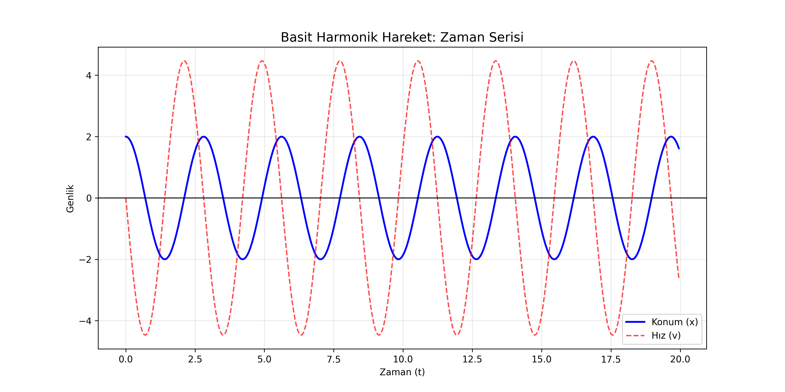
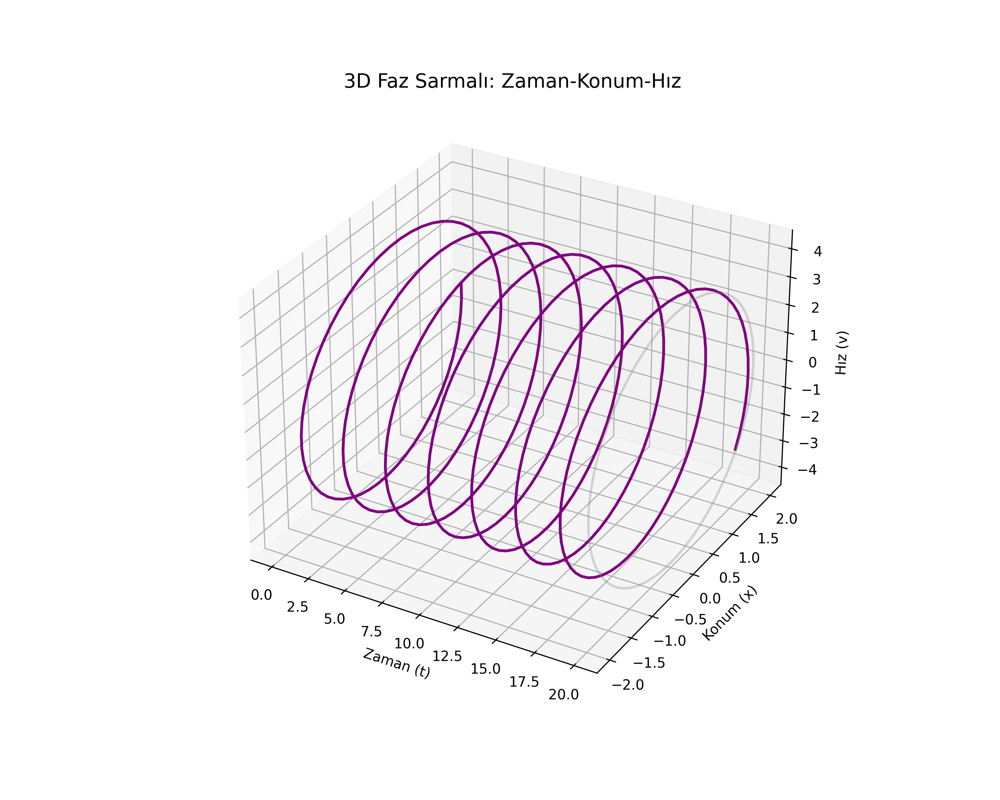

# Lesson 47: Simple Harmonic Motion (SHM) - The Rhythm of Physics

### 📗 The Second-Order Differential Equation
SHM occurs when the restoring force is directly proportional to the displacement:
$$m \frac{d^2x}{dt^2} = -kx$$
Which simplifies to:
$$\frac{d^2x}{dt^2} + \omega^2x = 0$$
where $\omega = \sqrt{k/m}$ is the angular frequency.

### 📝 Energy Conservation
In an ideal SHM system, energy oscillates between **Kinetic Energy** and **Potential Energy**, but the total mechanical energy remains constant.

---

### 📊 Visualizing the Oscillation

#### I. Displacement vs. Time (2D)
A perfect sine/cosine wave showing how the position $x(t)$ evolves. Notice the periodic nature and the constant amplitude in an undamped system.

#### II. Phase Space Portrait (3D)
By plotting **Position**, **Velocity**, and **Time**, we visualize the motion as a 3D spiral. The projection on the Position-Velocity plane creates a perfect circle (or ellipse), representing the conservation of energy.

