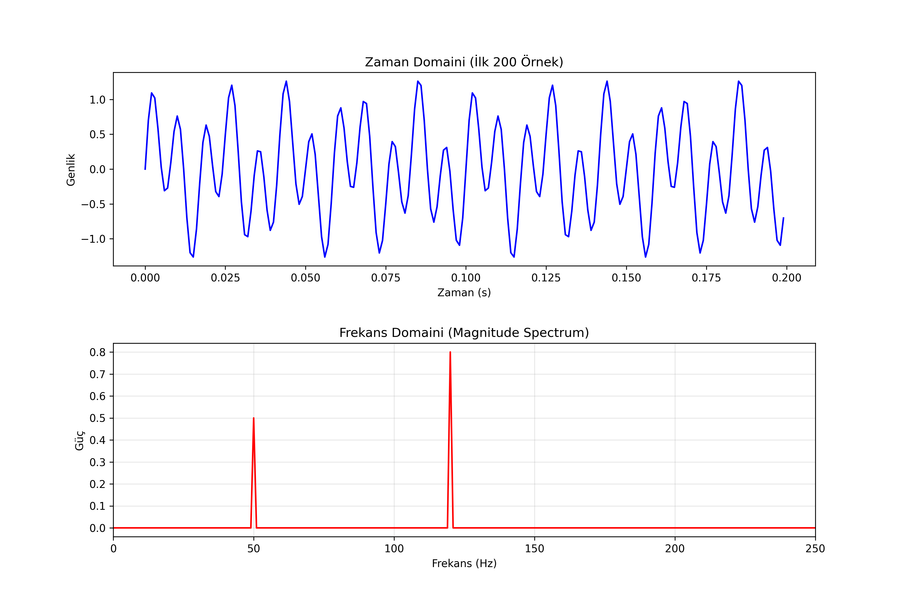
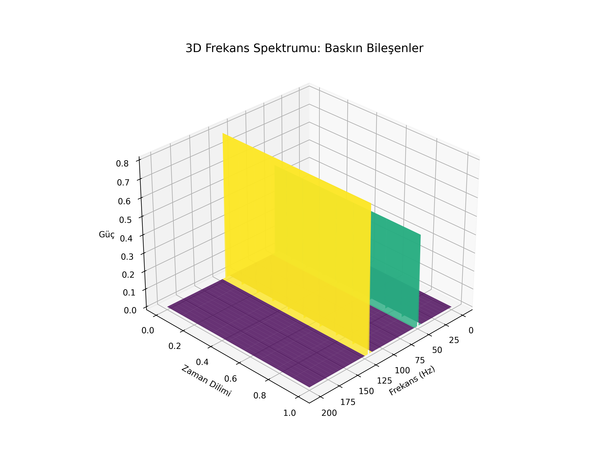

# Lesson 48: Fourier Transform - Decomposing Signals

### 📗 The Core Concept
The Fourier Transform $F(\omega)$ converts a signal from the time domain $f(t)$ to the frequency domain. It tells us "how much" of each frequency exists in the original signal.
$$F(\omega) = \int_{-\infty}^{\infty} f(t) e^{-i\omega t} dt$$

### 📝 Discrete Fourier Transform (DFT)
In the digital world, we use the Fast Fourier Transform (FFT) algorithm to compute this efficiently. It allows us to identify hidden patterns, noise, and dominant frequencies in data.

---

### 📊 Visualizing the Spectrum

#### I. Composite Signal (2D)
A complex-looking wave created by summing multiple sine waves of different frequencies. This is what we "see" in the time domain.

#### II. The Frequency Landscape (3D)
A 3D visualization showing the "Evolution of Spectrum." We plot **Time**, **Frequency**, and **Magnitude** to see how the frequency content of a signal might change or how individual components stand out as distinct "peaks."

