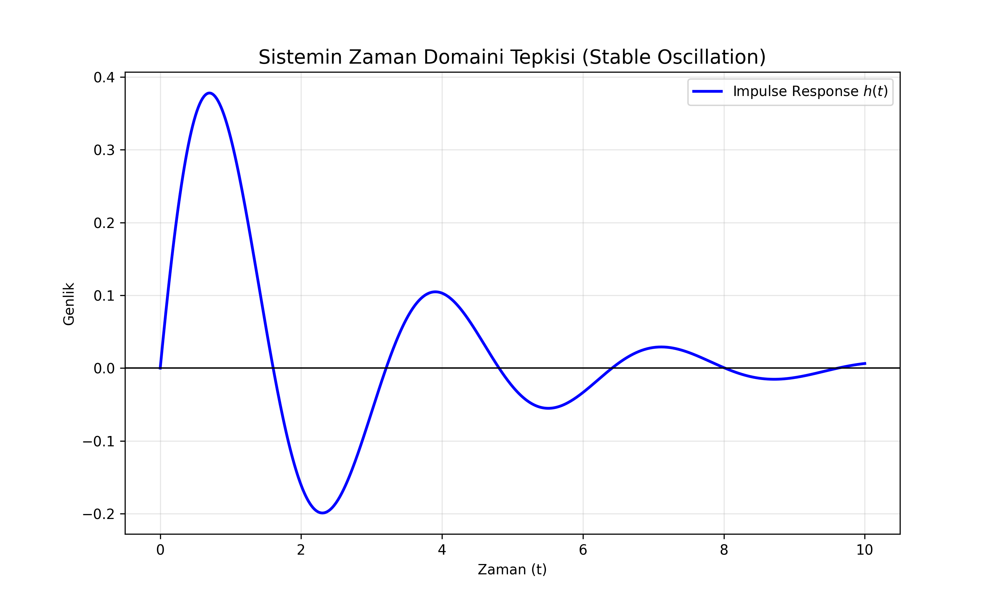
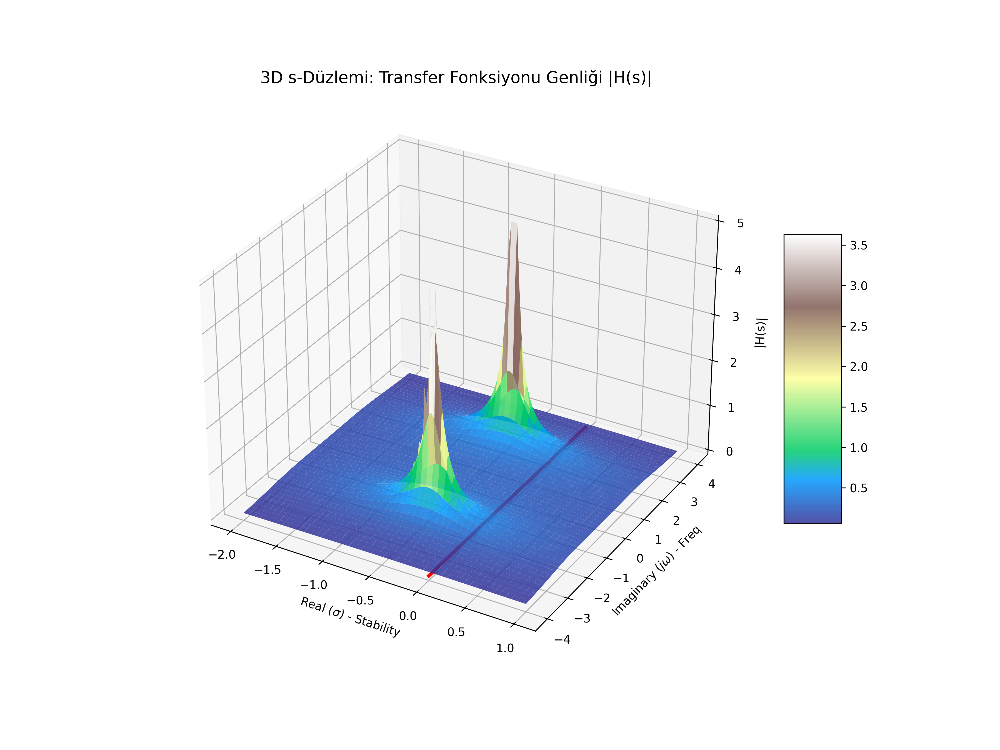

# Lesson 49: Laplace Transform - System Stability & s-Domain

### 📗 The Transformation
The Laplace Transform converts a time-domain function $f(t)$ into a complex frequency domain function $F(s)$:
$$F(s) = \int_{0}^{\infty} f(t) e^{-st} dt$$
where $s = \sigma + j\omega$ is a complex number.

### 📝 Poles and Zeros
- **Poles:** The values of $s$ where $F(s) \to \infty$. They determine the **stability** of the system.
- **Zeros:** The values of $s$ where $F(s) = 0$.
If any pole has a positive real part (lies on the right half-side of the s-plane), the system is **unstable**.

---

### 📊 Visualizing the s-Domain

#### I. Impulse Response (2D)
How the system reacts to a sudden shock in the time domain. We compare a stable (decaying) versus an unstable (growing) response.

#### II. The Pole-Zero Surface (3D)
A 3D landscape of $|F(s)|$ over the complex s-plane. The "tent poles" sticking up to infinity show exactly where the system's natural frequencies and stability limits lie.

