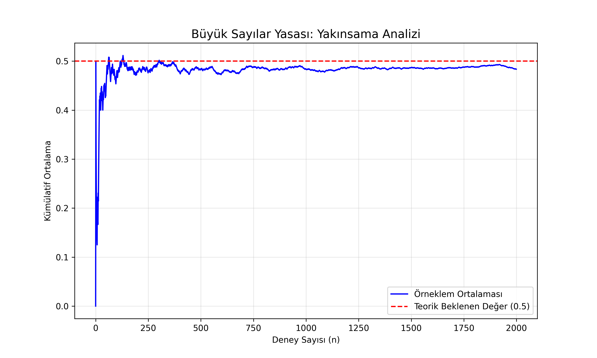
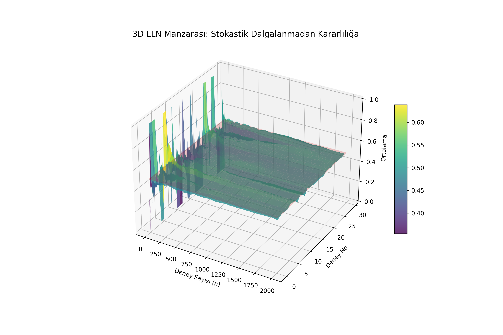

# Lesson 51: The Law of Large Numbers (LLN) - The Deterministic Anchor

### 📗 Theoretical Framework
The **Law of Large Numbers** is a fundamental theorem in probability that describes the result of performing the same experiment a large number of times. According to the law, the average of the results obtained from a large number of trials should be close to the **expected value** ($\mu$), and will tend to become closer as more trials are performed.

**Mathematical Definition:**
Given a sequence of independent and identically distributed (i.i.d.) random variables $X_1, X_2, \dots$ with $E[X_i] = \mu$:
$$\bar{X}_n = \frac{1}{n} \sum_{i=1}^n X_i \xrightarrow{n \to \infty} \mu$$

This is the "Strong Law," asserting that the convergence happens with probability 1.

---

### 📊 Visual Evidence & Numerical Analysis

In this module, we simulate thousands of Bernoulli trials (coin flips) to witness the transition from **Stochastic Chaos** to **Statistical Certainty**.

#### I. 2D Convergence Analysis (The Vibration of Truth)
This plot illustrates the cumulative average of a single experiment. 
- At low $n$, the variance is high (the "vibration").
- As $n$ approaches 2000, the average "anchors" to the theoretical probability of 0.5.

#### II. 3D Stability Landscape (The Collective Geometry)
By running 10 experiments simultaneously and plotting them as a 3D surface, we visualize the **Law of Large Numbers** as a stabilizing terrain. 
- **Z-Axis:** The cumulative average.
- **X-Axis:** Number of trials.
- **Observation:** Notice how the "mountainous" chaos at the beginning of the trials flattens into a "plateau" at the $0.5$ level.

---

### 🔬 Ph.D. Insights: Why This Matters
1. **The Fallacy of Small Numbers:** Many data analysts fail because they interpret patterns in small datasets. LLN proves that patterns below a certain $n$ are merely noise.
2. **Insurance & Finance:** This law is the reason insurance companies can stay profitable; individual risks are chaotic, but the collective risk is predictable.