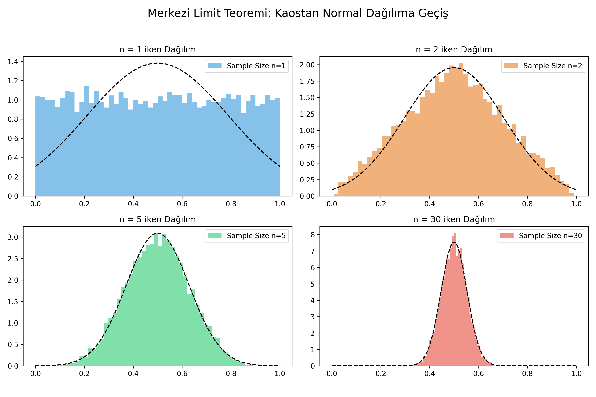
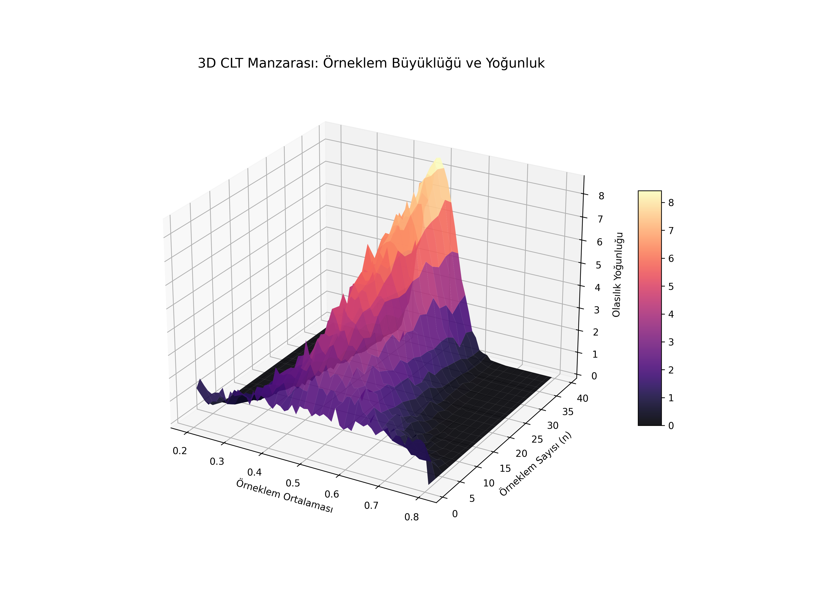

# Lesson 52: Central Limit Theorem (CLT) - The Universal Emergence

### 📗 The Mathematical Miracle
The **Central Limit Theorem** establishes that, in many situations, for independent and identically distributed (i.i.d.) random variables, the properly normalized sum tends toward a **normal distribution** even if the original variables themselves are not normally distributed.

**Formal Statement:**
If $X_1, X_2, \dots, X_n$ are i.i.d. with mean $\mu$ and variance $\sigma^2$, then as $n \to \infty$:
$$Z = \frac{\bar{X}_n - \mu}{\sigma / \sqrt{n}} \xrightarrow{d} N(0, 1)$$

---

### 📊 Visualizing the Emergence

In this lesson, we start with a **Uniform Distribution** (a flat, non-normal shape) and witness its evolution into a perfect Gaussian curve through sampling.

#### I. The Evolution of Distribution (2D)
We compare the original "flat" distribution with the distribution of its sample means. Notice how the "shoulders" of the Gaussian curve form as the sample size $n$ increases.

#### II. The Probability Landscape (3D)
A 3D visualization showing the **Sampling Distribution** over different sample sizes. It reveals the "sharpening" of the bell curve: as $n$ grows, the variance shrinks, and the "bell" becomes taller and thinner.

---

### 🔬 Ph.D. Insights: The Power of Inference
1. **Universal Applicability:** CLT is why we can use Z-tests and T-tests on real-world data even when we don't know the underlying distribution.
2. **Error Analysis:** It explains why measurement errors in physics and engineering often follow a normal distribution—they are the sum of many small, independent random factors.