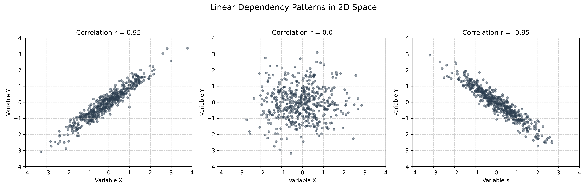
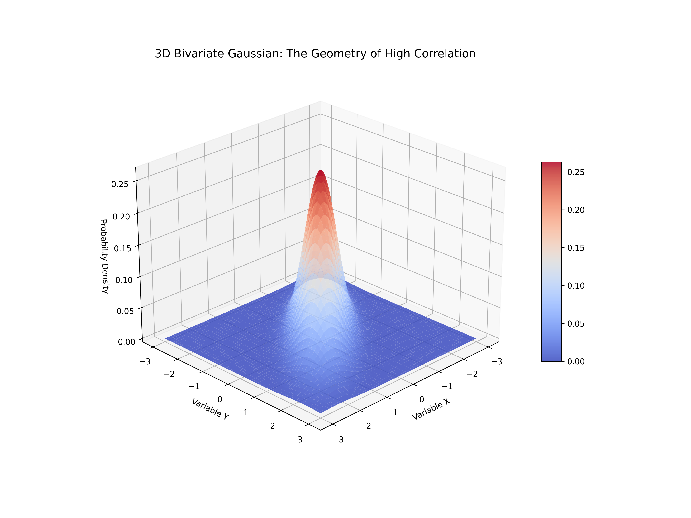

# Lesson 53: Covariance & Correlation - Mapping Dependencies

### 📗 The Mathematical Structure
**Covariance** measures the direction of the linear relationship between two random variables.
$$Cov(X, Y) = \frac{\sum (X_i - \bar{X})(Y_i - \bar{Y})}{n-1}$$

**Correlation ($r$)** is the normalized version of covariance, ranging from -1 to 1, providing a scale-independent measure of strength:
$$\rho_{X,Y} = \frac{Cov(X,Y)}{\sigma_X \sigma_Y}$$

---

### 📊 Visualizing the Dependency Landscape

In this lesson, we generate synthetic datasets with varying degrees of correlation to visualize how the "Joint Probability Density" shifts in 3D space.

#### I. Correlation Matrix & Scatter Dynamics (2D)
A multi-plot analysis showing how different correlation coefficients ($r = 0.9, 0, -0.9$) transform the shape of the data cloud from a tight line to a random mist.

#### II. The Bivariate Gaussian Surface (3D)
This is the "Visual Feast." We plot the **Joint PDF** (Probability Density Function) of two correlated variables.
- **High Correlation:** The surface stretches into a sharp "mountain ridge" along the diagonal.
- **Zero Correlation:** The surface becomes a perfectly symmetrical "circular bell."

---

### 🔬 Ph.D. Insights: Beyond the Coefficient
1. **The Shape of Information:** High covariance means knowing $X$ gives significant information about $Y$. In 3D, this is seen as a reduction in the "spread" of the surface.
2. **Feature Redundancy:** In data analysis, highly correlated features (the "ridges" we see in 3D) often indicate redundancy, which is the starting point for Dimensionality Reduction (PCA).
