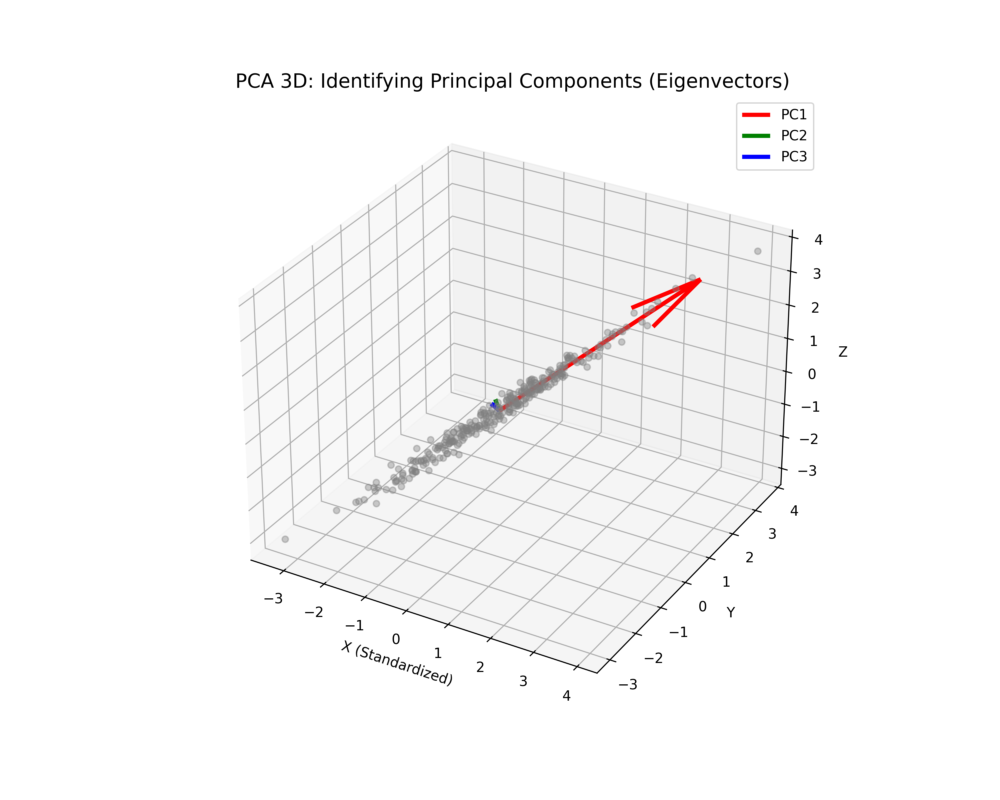
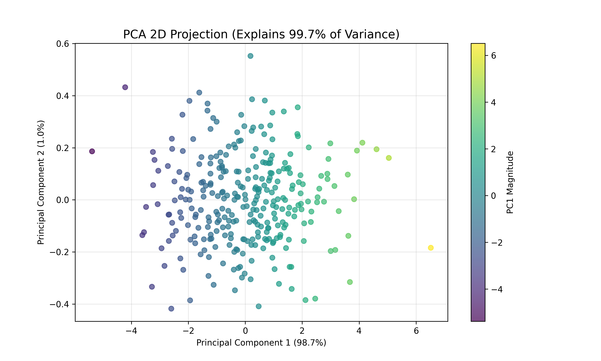

# Lesson 54: Principal Component Analysis (PCA) - Structural Insights

### 📗 The Mathematical Essence
PCA is an orthogonal linear transformation that transforms the data to a new coordinate system such that the greatest variance by some scalar projection of the data comes to lie on the first coordinate (called the first principal component, PC1), the second greatest variance on the second coordinate, and so on.

**Key Steps:**
1. **Standardization:** Scale the data to have a mean of 0 and variance of 1.
2. **Covariance Matrix:** Compute the matrix to understand how variables relate.
3. **Eigen-Decomposition:** Find the **Eigenvectors** (directions of variance) and **Eigenvalues** (magnitude of variance).

---

### 📊 Visualizing Information Compression

In this module, we take a 3D cloud of data and project it onto its two most significant components.

#### I. Principal Components in 3D Space
We visualize the original 3D data cloud along with the **Eigenvectors** (Principal Components). This shows exactly which direction holds the most "information."

#### II. 2D Projection & Variance Capture
By projecting the data onto the PC1-PC2 plane, we see how much of the original complexity is retained. A "Scree Plot" or a variance ratio analysis confirms the efficiency of the reduction.

---

### 🔬 Ph.D. Insights: The Logic of Projection
1. **Maximizing Variance:** PCA doesn't just "squash" data; it rotates the coordinate system to ensure that when we drop a dimension, we lose the *least* amount of information possible.
2. **Noise Reduction:** By keeping only the top components, we often filter out random noise that exists in the lower-variance dimensions.
