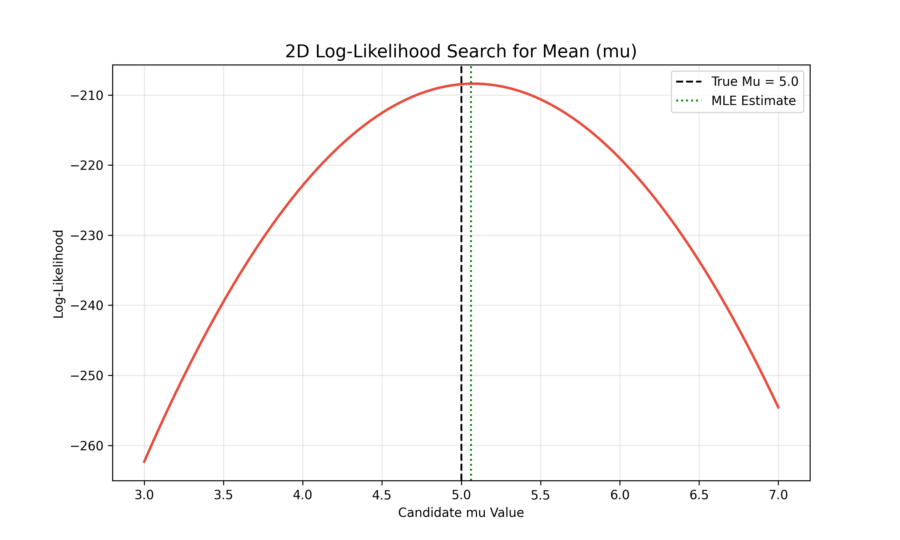
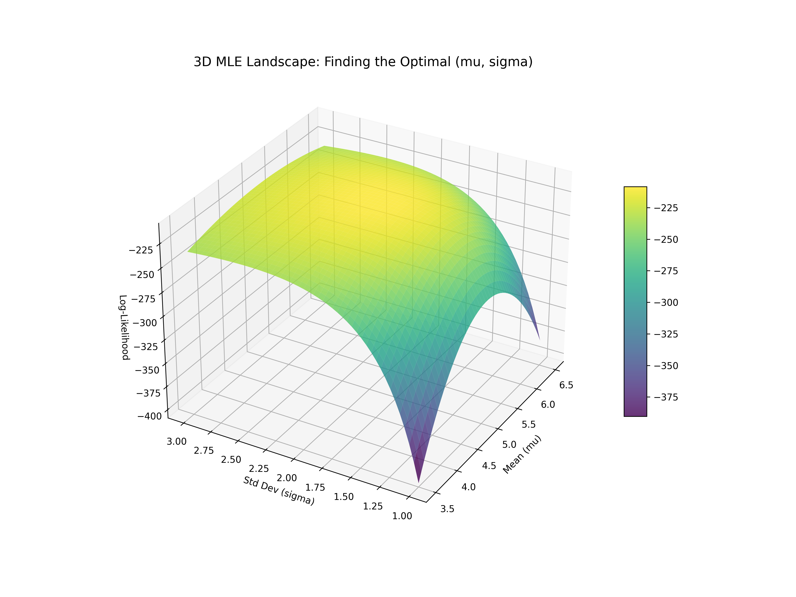

# Lesson 55: Maximum Likelihood Estimation (MLE)

### 📗 The Mathematical Essence
**Maximum Likelihood Estimation (MLE)** is a method of estimating the parameters of a probability distribution by maximizing a **likelihood function**, so that, under the assumed statistical model, the observed data is most probable.

**The Likelihood Function:**
Given data $x$, the likelihood of parameter $\theta$ is:
$$\mathcal{L}(\theta | x) = P(x | \theta)$$
In practice, we maximize the **Log-Likelihood** because it simplifies calculations for exponential families:
$$\ell(\theta) = \sum \log P(x_i | \theta)$$

---

### 🌍 Real-World Applications & Examples

#### 1. Machine Learning (Logistic Regression)
When you train a classifier to distinguish between spam and ham, the algorithm uses MLE to find the weights (parameters) that make the observed labels most likely given the input features.

#### 2. Biomedical Research (Dosage Response)
In clinical trials, researchers use MLE to estimate the "ED50" (effective dose for 50% of the population) by fitting a distribution to the observed patient recovery data.

#### 3. Econometrics (Consumer Behavior)
Economists use MLE to estimate parameters in discrete choice models—for example, predicting the likelihood of a consumer choosing a specific brand based on price and features.

---

### 📊 Visualizing the Likelihood Surface

In this module, we simulate a set of data points from a Normal Distribution and "search" for the best $\mu$ (mean) and $\sigma$ (standard deviation).

#### I. The Log-Likelihood Curve (2D)
A plot showing how the likelihood changes as we vary one parameter (e.g., $\mu$). The "peak" of this curve is our MLE estimate—the most logical explanation for our data.

#### II. The Likelihood Landscape (3D)
A 3D surface plot where the X and Y axes represent $\mu$ and $\sigma$, and the Z axis represents the Total Likelihood. We visualize the "Optimization Peak" that the algorithm must climb.

---

### 🔬 Ph.D. Insights: The "Frequentist" Philosophy
- **Objective Probability:** Unlike Bayesian methods, MLE assumes there is a fixed "true" parameter in nature, and we are just finding the value that makes our specific sample most plausible.
- **Asymptotic Normality:** One of the beauties of MLE is that as the sample size grows, the distribution of the MLE estimate itself becomes Normal (thanks to CLT!), allowing for easy confidence interval calculations.
