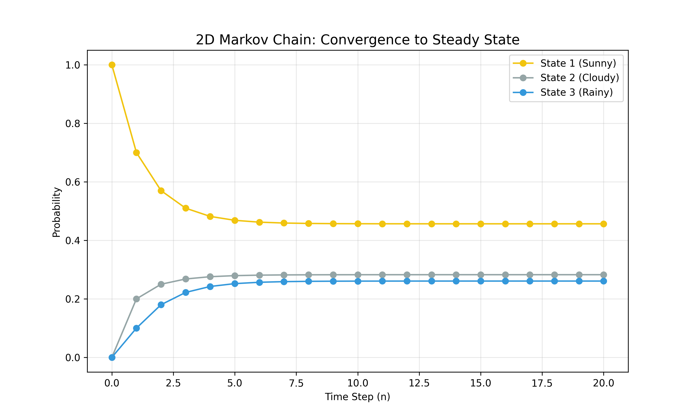
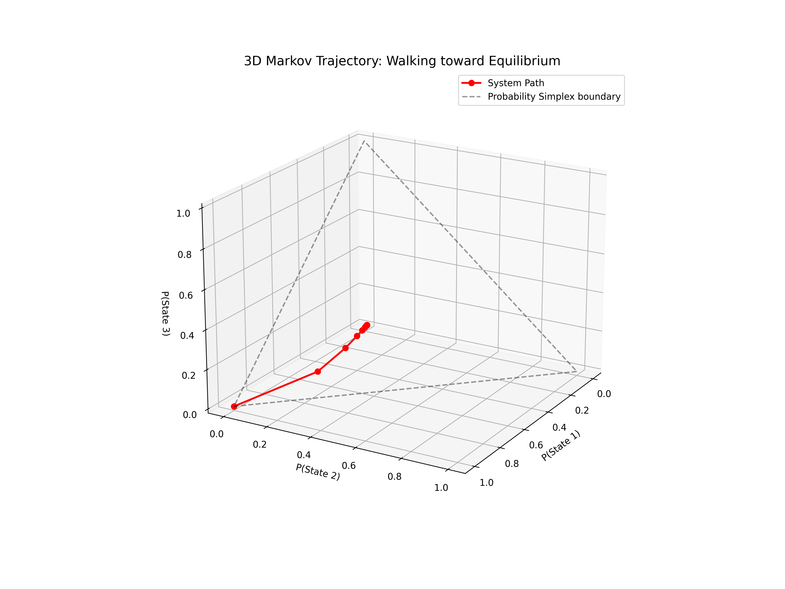

# Lesson 58: Markov Chains - Stochastic Transitions

### 📗 The Mathematical Essence
A **Markov Chain** is a stochastic model describing a sequence of possible events in which the probability of each event depends only on the state attained in the previous event.

**The Transition Matrix ($P$):**
If a system has $n$ states, $P$ is an $n \times n$ matrix where $P_{ij}$ is the probability of moving from state $i$ to state $j$.
- Each row must sum to 1.
- **Steady State ($\pi$):** The long-term probability distribution where $\pi P = \pi$.

---

### 🌍 Real-World Applications & Examples

#### 1. Weather Forecasting
A simple 2-state model (Sunny, Rainy). If it's sunny today, there's a 70% chance it's sunny tomorrow. Markov Chains help calculate the probability of it being rainy 10 days from now.

#### 2. Natural Language Processing (Next Word Prediction)
Your smartphone's keyboard uses Markov-like models to predict the next word. It looks at the current word you typed and suggests the most likely "next state" (word) based on frequency data.

#### 3. Finance & Credit Scoring
Banks use Markov models to predict the probability of a customer moving from "On-time Payer" to "Default" over several months, helping them manage financial risk.

---

### 📊 Visualizing the Flow

#### I. State Transition Dynamics (2D)
We track how the probability of being in each state evolves over "time steps." We witness the system converging from an initial guess to a stable **Steady State**.

#### II. The Probability Simplex (3D)
For a 3-state system, all possible probability distributions lie on a triangle (simplex). We visualize the trajectory of the system as it "walks" towards its equilibrium point in 3D space.

---

### 🔬 Ph.D. Insights: The Power of Equilibrium
- **Ergodicity:** If a chain is ergodic, it will reach the same steady state regardless of where it starts. It’s the "destiny" of the system.
- **Eigen-Link:** The steady state of a Markov Chain is actually the eigenvector of the transition matrix corresponding to the eigenvalue $\lambda = 1$. (A beautiful bridge to Lesson 57!)
