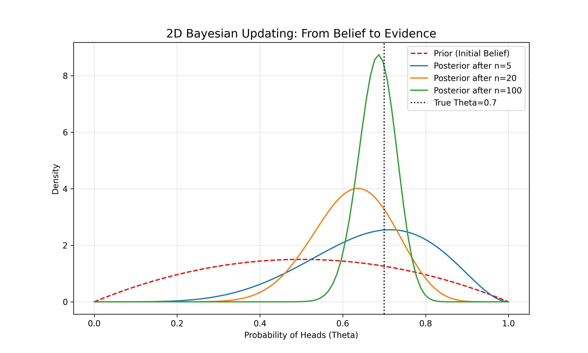
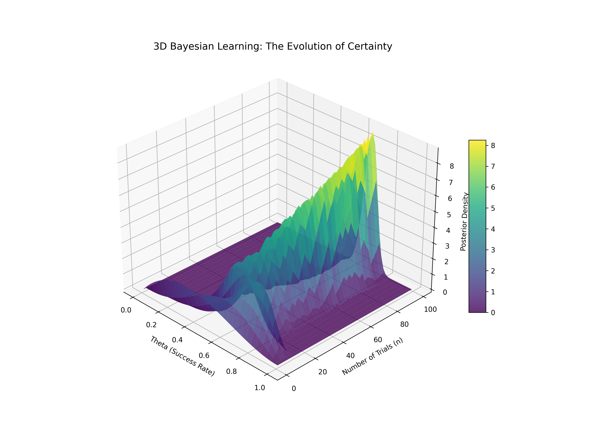

# Lesson 59: Bayesian Inference - Dynamic Knowledge Updating

### 📗 The Mathematical Essence
**Bayesian Inference** is a method of statistical inference in which Bayes' theorem is used to update the probability for a hypothesis as more evidence or information becomes available.

**Bayes' Theorem:**
$$P(\theta | D) = \frac{P(D | \theta) P(\theta)}{P(D)}$$
- **$P(\theta | D)$ (Posterior):** What we believe after seeing the data.
- **$P(D | \theta)$ (Likelihood):** How well the data fits our hypothesis.
- **$P(\theta)$ (Prior):** What we believed before seeing the data.
- **$P(D)$ (Evidence):** The total probability of the data.

---

### 🌍 Real-World Applications & Examples

#### 1. Medical Diagnosis
If a patient tests positive for a rare disease, a doctor doesn't just look at the test accuracy. They use **Bayesian Inference** to combine the test result with the disease's "Prior" prevalence in the population to find the *true* probability of infection.

#### 2. Spam Filtering (Naive Bayes)
Your email client has a "prior" idea of which words are spammy. Every time you mark an email as spam, it updates its "posterior" beliefs, becoming smarter at filtering future junk mail.

#### 3. Search and Rescue
When a ship goes missing at sea, rescuers use Bayesian models to create a "probability map." As they search areas and find nothing (new data), they update the map to focus on more likely locations.

---

### 📊 Visualizing the Learning Process

#### I. Prior to Posterior Transition (2D)
We watch a distribution "shift" and "narrow." We start with a vague idea (flat prior) and, as more data comes in, the distribution sharpens around the true value.

#### II. The Bayesian Learning Surface (3D)
A 3D visualization showing the evolution of the **Posterior PDF** as the number of observations ($n$) increases. It looks like a wave that starts wide and becomes a sharp, tall peak as certainty grows.

---

### 🔬 Ph.D. Insights: The Subjective vs. Objective
- **Prior Power:** In small datasets, your "prior" belief has a huge impact. In large datasets, the "data" (Likelihood) overwhelms the prior, leading everyone to the same conclusion regardless of their initial belief.
- **Sequential Learning:** One of the greatest strengths of this method is that today's *Posterior* becomes tomorrow's *Prior*. Learning is a continuous loop.
