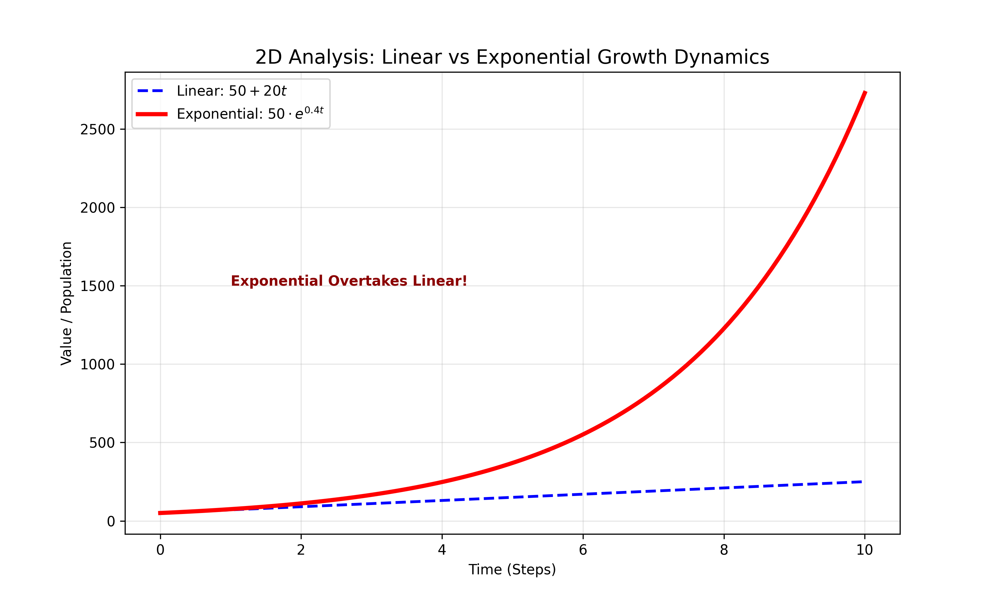
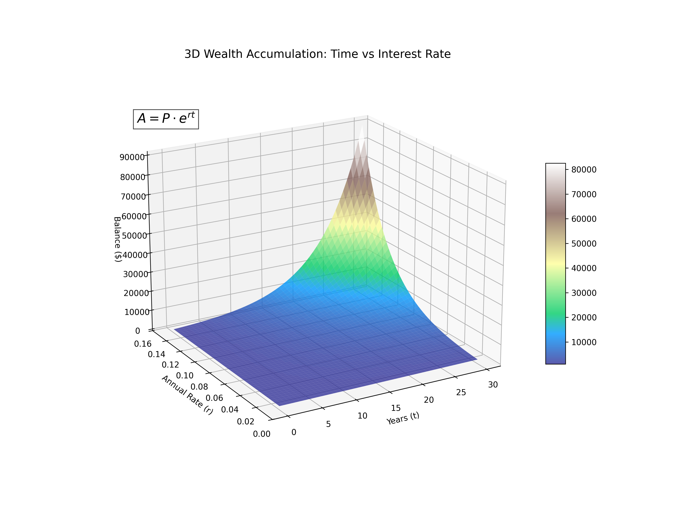

# Lesson 63: Exponential Growth & Decay

### 📗 The Mathematical Essence (High School Level)
Exponential functions describe processes where the rate of change is proportional to the current value. As the value gets bigger, it grows even faster.

**The General Formula:**
$$f(t) = a \cdot e^{rt}$$
- **$a$:** Initial value (Starting point).
- **$r$:** Growth rate (if positive) or Decay rate (if negative).
- **$e$:** Euler's constant ($\approx 2.718$), the natural base of growth.

---

### 🌍 Real-World Applications & Examples

#### 1. Social Media Virality
If each person shares a video with 2 friends every hour, the number of views doesn't just increase; it explodes. This is why "going viral" happens so suddenly—the curve turns almost vertical.

#### 2. Finance (The 8th Wonder: Compound Interest)
Saving money with compound interest is exponential growth. Your interest earns interest. Over 30 years, this "r" rate can turn small savings into a fortune.

#### 3. Carbon Dating & Medicine (Half-Life)
Radioactive elements and medicines in your bloodstream follow **Exponential Decay**. Doctors use the "half-life" formula ($e^{-rt}$) to calculate exactly when you need your next dose of medicine.

---

### 📊 Visualizing the Explosion and the Fade

#### I. Viral Growth vs. Linear Growth (2D)
A comparison showing how a linear process (adding 10 every day) is quickly overtaken by an exponential process (growing by 10% every day).

#### II. The Surface of Interest Rates (3D)
We visualize how your final balance ($Z$) changes based on both the **Time** ($X$) and the **Interest Rate** ($Y$). This 3D slope shows why even a 1% difference in rates matters immensely over time.

